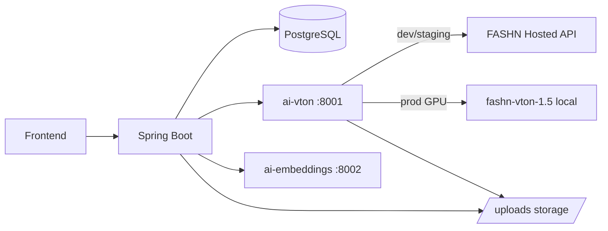

# FitMe AI — Kiến trúc AI

Tài liệu mô tả vị trí các service AI trong hệ thống FitMe, ranh giới với Spring Boot, và luồng dữ liệu try-on / recommendation.

> Đọc kèm: [ARCHITECTURE.md](ARCHITECTURE.md), [FASHN_VTON_INTEGRATION.md](FASHN_VTON_INTEGRATION.md), [AI_ROADMAP.md](AI_ROADMAP.md)

---

## 1. Tổng quan

FitMe tách **logic AI** ra microservice Python (FastAPI) và giữ **orchestration, auth, persistence** trong Spring Boot:

| Service | Port (Docker) | Vai trò |
|---------|---------------|---------|
| `ai-vton` | 8001 | Virtual try-on (FASHN VTON hybrid) |
| `ai-embeddings` | 8002 | Text embeddings cho semantic scoring |
| `fitme-backend` | 8080 | API, job polling, lưu preview, recommendation |
| `fitme-frontend` | 3000 | Polling UI, hiển thị kết quả |



---

## 2. Runtime modes (`FITME_AI_MODE`)

| Mode | Mô tả | Khi nào dùng |
|------|--------|--------------|
| `mock` | Không gọi FASHN; outfit board placeholder | CI, local dev không có API key |
| `api` | `ai-vton` gọi FASHN hosted API | Dev/staging có `FASHN_API_KEY` |
| `local` | `ai-vton` chạy model self-host (GPU) | Production worker riêng |

Cấu hình Spring (`application.yml`):

```yaml
fitme:
  ai:
    mode: mock          # api | local | mock
    vton-base-url: http://ai-vton:8001
    embeddings-base-url: http://ai-embeddings:8002
    public-base-url: http://localhost:8080
    fashn-api-key: ${FASHN_API_KEY:}
    job-timeout-seconds: 120
    semantic-score-weight: 20
```

---

## 3. Luồng try-on (async)

1. User upload ảnh → `user_photo_uploads` (local `/uploads`).
2. User tạo try-on request + items → `POST /try-on/requests/{id}/generate`.
3. Backend tạo `preview_generations` (`PROCESSING`), gán `preview_generation_id` cho try-on.
4. Backend gọi `POST /v1/try-on` trên `ai-vton` (person URL + garment URL + category).
5. `TryOnJobPoller` poll job → cập nhật preview URL / lỗi → try-on `COMPLETED` hoặc `FAILED`.
6. Frontend poll `GET /try-on/requests/{id}` hoặc `/result` đến khi xong.

**Fallback:** category không hỗ trợ VTON (giày, phụ kiện) hoặc job fail → outfit board mock (`OutfitBoardPreviewGenerator`).

---

## 4. Luồng recommendation (semantic boost)

1. Rule-based scoring hiện có trong `OutfitScoringService` (tag, style/occasion rules, gender/fit).
2. `SemanticScoringService` gọi `ai-embeddings` cosine similarity: `(styleProfile + occasion)` vs `(product tags + name + description)`.
3. Điểm semantic (tối đa `semantic-score-weight`, mặc định 20) cộng vào score tổng.
4. Vector sản phẩm cache trong `products.style_embedding` (JSONB) khi admin duyệt ACTIVE.

Nếu `ai-embeddings` down → chỉ dùng rule scoring (hành vi cũ).

---

## 5. Hạ tầng & deploy

### Dev (Docker Compose profile `ai`)

```bash
docker compose --profile ai up -d
```

Services: `postgres`, `backend`, `frontend`, `ai-vton`, `ai-embeddings`.

### Production hybrid

- **API path:** Render/Vercel backend + `ai-vton` mode `api` + `FASHN_API_KEY`.
- **Self-host path:** GPU worker (RunPod, EC2 g4, v.v.) chạy `Dockerfile.gpu` với weights ~2GB.
- Xem [DEPLOY_VERCEL_RENDER_NEON.md](DEPLOY_VERCEL_RENDER_NEON.md) — mục GPU worker.

### Biến môi trường chính

| Biến | Service | Mô tả |
|------|---------|--------|
| `FITME_AI_MODE` | backend + ai-vton | `mock` / `api` / `local` |
| `FASHN_API_KEY` | ai-vton (api mode) | Key FASHN hosted |
| `AI_VTON_URL` | backend | Base URL ai-vton |
| `AI_EMBEDDINGS_URL` | backend | Base URL ai-embeddings |
| `FITME_PUBLIC_BASE_URL` | backend | URL public cho ảnh `/uploads` |

---

## 6. Privacy & retention

- Ảnh user lưu local/cloud storage theo chính sách hiện tại; chỉ gửi **URL** cho worker AI (không gửi raw bytes qua API public nếu tránh được).
- Disclaimer bắt buộc trên mọi preview AI.
- Retention: tuân theo `fitme.privacy` và consent upload; xóa mềm qua `deleted_at` trên `user_photo_uploads`.

---

## 7. Thư mục code

```
ai-services/
  vton/           # FastAPI VTON
  embeddings/     # FastAPI embeddings
backend/src/main/java/com/fitme/
  ai/             # AiVtonClient, EmbeddingClient, VtonCategoryMapper
  preview/        # VtonPreviewGenerator, TryOnJobPoller
  recommendation/ # SemanticScoringService
```
