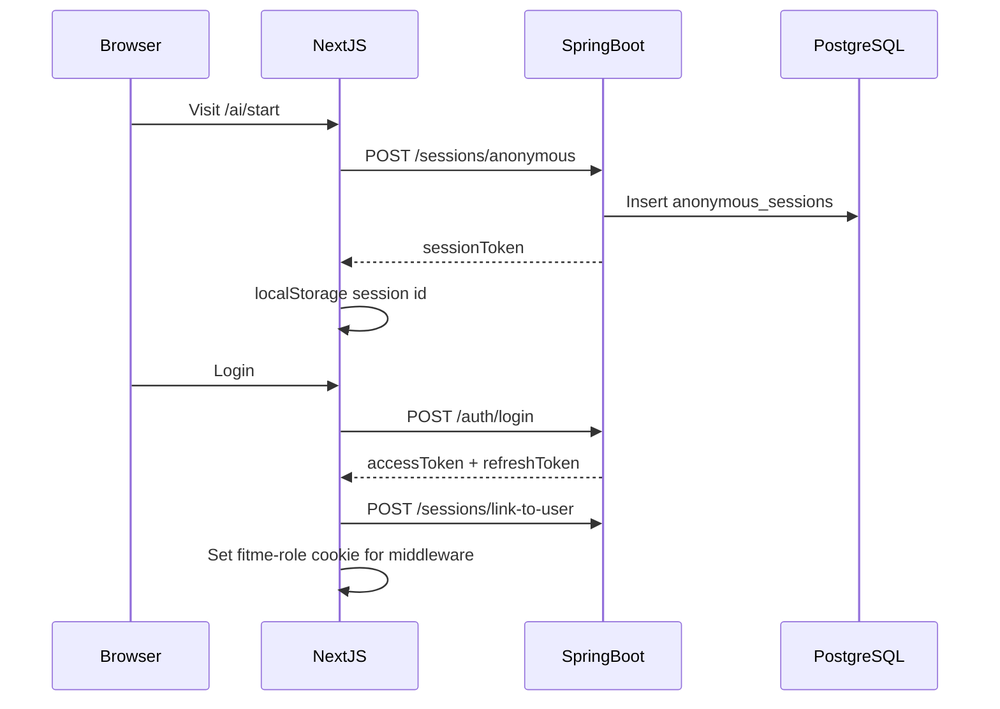

# FitMe AI — Architecture Overview

## System context

```
Browser → Next.js (frontend :3000) → rewrite /api/v1 → Spring Boot (backend :8080) → PostgreSQL
```

- **Anonymous users:** `X-Anonymous-Session` header from localStorage
- **Authenticated users:** `Authorization: Bearer <JWT>` + optional session header
- **Portals:** Brand (`/brand/*`), Admin (`/admin/*`) — RBAC via JWT role + Next.js middleware cookie `fitme-role`

## Frontend layers

```
app/                    Route pages (App Router)
  ├── page.tsx          Marketing home (custom full-bleed layout)
  ├── ai/               AI consultation wizard
  ├── try-on/           Virtual try-on flow
  ├── auth/             Login / register / password reset
  ├── brand/ admin/     Portal pages (PortalLayout)
  └── ...

components/
  ├── ui/               Radix primitives (button, card, input, chip…)
  ├── layout/           App chrome
  │   ├── Header Footer           Consumer nav
  │   ├── PortalLayout            Brand/Admin sidebar shell
  │   ├── PageShell PageHeader    Consumer page scaffolding
  │   ├── FlowStepper             Read-only wizard progress
  │   ├── AuthCardShell           Auth card + logo
  │   └── PortalLoginShell        Brand/Admin login
  ├── common/           EmptyState, ProductCard, LoadingSkeleton…
  ├── tryon/            TryOnVariantShell
  └── brand/ product/   Domain-specific forms

services/               HTTP clients → backend /api/v1
stores/                 Zustand (auth, session, consultation, tryon)
hooks/                  use-ensure-session, use-auth-redirect, use-tryon-variant
types/                  TypeScript domain types
lib/design-tokens.ts    Presentational class constants
```

### Layout conventions

| Context | Wrapper | Max width |
|---------|---------|-----------|
| Consumer flow pages | `PageShell` + `PageHeader` | narrow (xl), medium (2xl), wide (4xl/7xl) |
| Marketing home | Custom sections | full-bleed hero |
| Auth | `AuthCardShell` | max-w-md centered |
| Brand/Admin portal | `PortalLayout` | max-w-7xl inside sidebar layout |

**Do not change** `h1` text, button labels, or form field `id`/`label` when restyling — E2E tests depend on them.

## Backend layers

```
com.fitme/
  ├── {domain}/
  │   ├── controller/   REST @RequestMapping /api/v1/...
  │   ├── service/      Business logic
  │   ├── repository/   Spring Data JPA
  │   ├── entity/       JPA entities
  │   └── dto/          Request/response records
  ├── common/
  │   ├── config/       FitMeProperties, WebConfig, SeedDataLoader
  │   ├── security/     JWT, filters, RequestContext, OwnershipChecker
  │   ├── exception/    GlobalExceptionHandler, BusinessException
  │   ├── dto/          ApiResponse<T> envelope
  │   └── enums/        Shared domain enums
  └── storage/          LocalStorageService (uploads)
```

### Recommendation pipeline (refactored)

```
RecommendationController
  → RecommendationService (orchestration)
      → WardrobeBlendService
      → OutfitScoringService
      → OutfitCompositionService
      → SizeResolutionService
      → RecommendationMapper
```

### Admin surface

```
AdminController → AdminRuleService, BrandService, RedirectService, PrivacyService
                → AdminFlaggedLinkService, AdminPreviewMonitoringService
AdminProductController → ProductService (moderation)
```

All responses use `ApiResponse<T>`: `{ success, data, error?, message? }`.

## Auth & session flow



## Database

- Flyway migrations: `backend/src/main/resources/db/migration/`
- `V1__init_schema.sql` — 24 tables
- `V2__auth_tokens.sql` — refresh token revocations
- Hibernate `ddl-auto: validate` (schema owned by Flyway)

## Testing pyramid

| Layer | Tool | Location |
|-------|------|----------|
| Backend unit/integration | JUnit 5 + MockMvc + Testcontainers | `backend/src/test/` |
| Frontend unit | Vitest + Testing Library | `frontend/src/**/*.test.ts(x)` |
| E2E | Playwright | `frontend/e2e/` |
| CI | GitHub Actions | `.github/workflows/ci.yml` |
| Local all-flows | `scripts/test-flows.ps1` | Windows |

## CI pipeline

1. **backend-test** — `mvn test` (Testcontainers PostgreSQL)
2. **frontend-unit** — `npm test`
3. **frontend-build** — `npm run build`
4. **e2e** — Postgres service + Spring Boot + Playwright (`smoke-routes` + `role-flows`)

See also: [`API_CONTRACT.md`](API_CONTRACT.md), [`QA_REPORT.md`](QA_REPORT.md), [`USER_GUIDE.md`](USER_GUIDE.md), [`DEVELOPER_GUIDE.md`](DEVELOPER_GUIDE.md).
