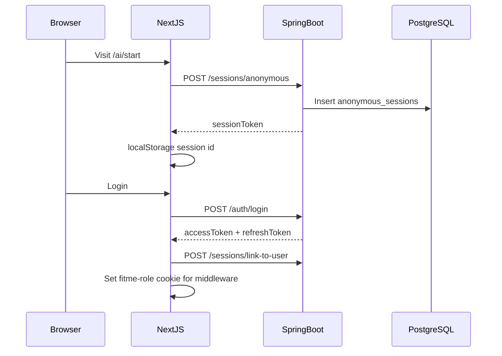

# FitMe AI — Architecture Overview

## System context

```
Browser → Next.js (frontend :3000) → rewrite /api/v1 → Spring Boot (backend :8080) → PostgreSQL
```

- **Anonymous users:** `X-Anonymous-Session` header from localStorage
- **Authenticated users:** `Authorization: Bearer <JWT>` + optional session header
- **Portals:** Brand (`/brand/*`), Admin (`/admin/*`) — RBAC via JWT role + Next.js middleware cookie `fitme-role`

## Frontend layers

```
app/                    Route pages (App Router)
  ├── page.tsx          Marketing home (custom full-bleed layout)
  ├── ai/               AI consultation wizard
  ├── try-on/           Virtual try-on flow (tiêu thụ Fitken khi generate AI)
  ├── pricing/          Bảng giá consumer: FitMe Free vs FitMe Premium
  ├── billing/return/   Xác nhận thanh toán PayOS gói Premium
  ├── rewards/          Trang Nhận thưởng (điểm danh, chia sẻ, đánh giá)
  ├── redirect/         Xác nhận mua tại cửa hàng gốc (consent chia sẻ thông tin) → loading → URL brand
  ├── profile/          Hồ sơ, thư viện ảnh (`gallery`), tủ chi tiêu (`purchases`), brand yêu thích (`style-preferences`)
  ├── wardrobe/         Tủ đồ cá nhân (Premium)
  ├── auth/             Login / register / password reset
  ├── brand/            Brand portal: catalog, khách quan tâm (`leads`), Gói Plus (`plan`), analytics
  ├── admin/            Admin portal: tài khoản, brand/SP, gói dịch vụ, voucher brand, cài đặt, retention, rewards, reviews
  └── ...

components/
  ├── ui/               Radix primitives (button, card, input, chip…)
  ├── layout/           App chrome
  │   ├── Header Footer           Consumer nav
  │   ├── PortalLayout            Brand/Admin sidebar shell
  │   ├── PageShell PageHeader    Consumer page scaffolding
  │   ├── FlowStepper             Read-only wizard progress
  │   ├── AuthCardShell           Auth card + logo
  │   └── PortalLoginShell        Brand/Admin login
  ├── common/           EmptyState, ProductCard, LoadingSkeleton…
  ├── tryon/            TryOnVariantShell
  └── brand/ product/   Domain-specific forms

services/               HTTP clients → backend /api/v1
stores/                 Zustand (auth, session, consultation, tryon)
hooks/                  use-ensure-session, use-auth-redirect, use-tryon-variant
types/                  TypeScript domain types
lib/design-tokens.ts    Presentational class constants
```

### Layout conventions

| Context | Wrapper | Max width |
|---------|---------|-----------|
| Consumer flow pages | `PageShell` + `PageHeader` | narrow (xl), medium (2xl), wide (4xl/7xl) |
| Marketing home | Custom sections | full-bleed hero |
| Auth | `AuthCardShell` | max-w-md centered |
| Brand/Admin portal | `PortalLayout` | max-w-7xl inside sidebar layout |

**Do not change** `h1` text, button labels, or form field `id`/`label` when restyling — E2E tests depend on them.

## Backend layers

```
com.fitme/
  ├── fitken/           Ví Fitken (TRIAL, CHECKIN, SHARE, REVIEW, TRY_ON_SPEND), ledger, trần Fitken miễn phí
  ├── billing/          BillingPlan (audience CONSUMER/BRAND), gói Premium, đơn PayOS, PayOS webhook, job hết hạn đơn chờ
  ├── entitlement/      Phân tầng FitMe Free vs FitMe Premium (coherence modes PREFER/STRICT, requirePremium)
  ├── preference/       Brand yêu thích của người dùng Premium (DIVERSE / FAVORITES_ONLY)
  ├── brandplus/        Gói Brand Plus: báo giá, checkout PayOS, kích hoạt / gia hạn, hết hạn
  ├── brandvoucher/     Chiến dịch voucher, phát / thu hồi voucher brand, giữ voucher cho đơn Plus
  ├── brandlead/        Khách quan tâm (lead có consent) từ buy-click, đánh dấu đã bán
  ├── settings/         Cài đặt hệ thống (trần Fitken, lượt thử Plus miễn phí, điểm ưu tiên Plus), cache 60s
  ├── rewards/          Điểm danh chuỗi 3 ngày, nộp link chia sẻ mạng xã hội
  ├── review/           Đánh giá sản phẩm có ảnh, nhãn "Đã mua hàng" (tự xác nhận mua hoặc lead đã bán)
  ├── gallery/          Thư viện ảnh outfit cá nhân (`outfit_gallery_images`)
  ├── product/          Catalog sản phẩm (purchaseUrl bắt buộc), kiểm duyệt admin
  ├── brand/            Brand profile, đăng ký brand, dashboard brand
  ├── redirect/         Buy-click, chuyển khách sang cửa hàng gốc, lịch sử mua, tạo lead
  ├── wardrobe/         Tủ đồ cá nhân (Premium)
  ├── recommendation/   Gợi ý phối đồ AI (hybrid rule + Gemini Flash), ưu tiên brand Plus
  ├── stylistchat/      Chat stylist AI
  ├── tryon/            Lifecycle thử đồ ảo (1 Fitken/lượt AI hoặc lượt Plus miễn phí)
  ├── preview/          Upload ảnh người dùng, gọi microservice VTON (FASHN/HF)
  ├── analytics/        Dashboard brand/admin, tăng trưởng, retention, khách trả tiền, truy cập
  ├── auth/ session/    JWT, xác thực email, liên kết phiên ẩn danh
  ├── privacy/          Consent (kể cả BRAND_LEAD_SHARING), yêu cầu xóa dữ liệu (GDPR/PDPA)
  ├── admin/            Rules, flagged links, quản lý tài khoản, avatar thử đồ, monitoring
  ├── storage/          Lưu trữ file local / Cloudflare R2
  └── common/           Security, config (FitMeProperties), ApiResponse envelope, exception
```

Các package thương mại `cart`, `address`, `order`, `settlement`, `logistics`, `voucher` (voucher freeship người dùng) đã bị gỡ ở V27.

### B2C Core & Brand Plus Subsystems

1. **Fitken Tokenomics & Try-on**:
   - 1 Fitken = 1 lượt thử đồ AI (`USER_PHOTO` / `AVATAR`). `OUTFIT_BOARD_ONLY` miễn phí.
   - Ví gồm 2 ngăn: `subscription_remaining` (từ gói Premium, reset về 0 khi hết hạn) và `bonus_remaining` (tặng 5 Fitken dùng thử lần đầu, điểm danh, chia sẻ, đánh giá, top-up, admin cấp — không hết hạn). Tiêu ngăn subscription trước.
   - **Trần Fitken miễn phí** (`fitken.max_balance`, mặc định 50): trial / điểm danh / chia sẻ / đánh giá chỉ cộng tới trần. Premium, top-up, admin điều chỉnh không bị áp trần.
   - Trừ Fitken lúc bắt đầu generate; hoàn lại nếu kết quả thất bại hoặc dùng ảnh fallback minh họa.
   - **Lượt thử Plus miễn phí**: khi mọi sản phẩm thuộc brand đang Plus, user đăng nhập được thử miễn phí `tryon.plus_free_daily` lượt/ngày (mặc định 3, bảng `plus_free_tryon_usage`); lỗi nhà cung cấp hoàn lượt.
2. **Gói FitMe Premium** (`PREMIUM_MONTHLY`, mặc định 49.000đ / 30 ngày):
   - PayOS checkout: +15 Fitken vào ngăn subscription.
   - Mở tủ đồ cá nhân, brand yêu thích (`PREMIUM_REQUIRED` cho user Free), coherence `PREFER`/`STRICT`.
   - Giá trị cũ `PRO` / `PLUS` của `consumer_plan` được đọc thành `PREMIUM`.
3. **Mua tại cửa hàng gốc & khách quan tâm**:
   - FitMe không bán hàng. `purchaseUrl` của sản phẩm bắt buộc (`INVALID_PURCHASE_URL` nếu sai). Buy-click chuyển khách sang URL brand.
   - User đăng nhập đang đồng ý `BRAND_LEAD_SHARING` → tạo `brand_leads` (1 / user / sản phẩm / ngày). Rút đồng ý → brand thấy `WITHDRAWN`; xoá tài khoản → `user_id = NULL` (`ANONYMIZED`).
4. **Brand Plus** (`BRAND_PLUS`, mặc định 999.000đ / 30 ngày):
   - Quyền lợi: huy hiệu Plus, lượt thử miễn phí cho khách, ưu tiên gợi ý (`recommendation.plus_boost`), xem chi tiết lead và đánh dấu đã bán (`PLUS_REQUIRED` nếu không Plus).
   - Giá: chỉ áp **một** mức giảm — cao hơn giữa giảm theo thời gian của gói (`WINDOW`) và voucher (`VOUCHER`). Voucher được áp chuyển `RESERVED`; đơn PAID → `USED`, FAILED / CANCELLED / EXPIRED → trả về `ISSUED`.
   - Gia hạn cộng nối vào `endsAt` hiện tại. Webhook PayOS dùng chung với đơn Premium, idempotent.
5. **Nhận thưởng & Đánh giá**:
   - Điểm danh chuỗi 3 ngày liên tiếp: +1 Fitken (`CHECKIN_REWARD`).
   - Chia sẻ bài đăng mạng xã hội: +3 Fitken (`SHARE_REWARD`), tối đa 1 lần/ngày, admin có thể duyệt/từ chối.
   - Đánh giá sản phẩm có ảnh (≥20 ký tự, ≥1 ảnh): +2 Fitken (`REVIEW_REWARD`), tối đa 1 đánh giá được thưởng/ngày.
   - Tất cả thưởng bị giới hạn bởi trần Fitken miễn phí.

### Scheduled jobs

| Job | Lịch | Việc làm |
|-----|------|----------|
| `ConsumerSubscriptionService` | 00:05 hằng ngày (`Asia/Ho_Chi_Minh`) | Hết hạn Premium, reset ngăn subscription |
| `BrandPlusService` | 00:10 hằng ngày | Hết hạn Brand Plus |
| `BrandVoucherService` | 00:15 hằng ngày | Chuyển voucher quá hạn sang `EXPIRED` |
| `BillingOrderExpiryJob` | Mỗi 15 phút (chạy lần đầu sau 1 phút) | Đơn gói `PENDING` quá `fitme.billing.pending-expiry-hours` (24h) → `EXPIRED` |
| `TryOnJobPoller` | Mỗi `fitme.ai.poll-interval-ms` (3s) | Poll job VTON |

### Recommendation pipeline

```
RecommendationController
  → RecommendationService (orchestration)
      → WardrobeBlendService
      → OutfitScoringService
      → OutfitCompositionService
      → SizeResolutionService
```

*Lưu ý:* `ProductEligibilityService` lọc sản phẩm ACTIVE, không `OUT_OF_STOCK` (trạng thái cấp sản phẩm; tồn kho biến thể đã bỏ ở V27) và có ảnh; không còn ràng buộc quota theo brand. `OutfitScoreContext` cộng điểm `recommendation.plus_boost` cho sản phẩm brand Plus; brand yêu thích của user Premium (`preference/`) lọc hoặc ưu tiên brand khi phối.

### Admin surface

```
AdminController → AdminRuleService, BrandService, RedirectService, PrivacyService
                → AdminFlaggedLinkService, AdminPreviewMonitoringService
                → Metrics, retention, khách trả tiền, dashboard
AdminUserController → Quản lý tài khoản, khoá / mở, gán Premium (consumer-plan)
AdminFitkenController → Quản lý số dư & điều chỉnh Fitken người dùng
AdminRewardController → Duyệt / từ chối link chia sẻ nhận thưởng
AdminReviewController → Kiểm duyệt & ẩn đánh giá sản phẩm
AdminBillingController → Gói dịch vụ (người dùng + brand, giảm giá theo thời gian cho gói brand)
AdminBrandPlusController → Danh sách brand đã mua Plus
AdminVoucherCampaignController → Chiến dịch voucher, phát / thu hồi voucher brand
AdminSystemSettingsController → Cài đặt hệ thống (system_settings)
AdminProductController → Kiểm duyệt sản phẩm của brand (chặn duyệt khi thiếu purchaseUrl hợp lệ)
AdminTryOnAvatarController → Avatar mẫu thử đồ
```

All responses use `ApiResponse<T>`: `{ success, data, error?, message? }`.

## Auth & session flow


```mermaid
sequenceDiagram
  participant Browser
  participant FE as NextJS
  participant BE as SpringBoot
  participant DB as PostgreSQL

  Browser->>FE: Visit /ai/start
  FE->>BE: POST /sessions/anonymous
  BE->>DB: Insert anonymous_sessions
  BE-->>FE: sessionToken
  FE->>FE: localStorage session id

  Browser->>FE: Login
  FE->>BE: POST /auth/login
  BE-->>FE: accessToken + refreshToken
  FE->>BE: POST /sessions/link-to-user
  FE->>FE: Set fitme-role cookie for middleware
```

## Database

- Flyway migrations: `backend/src/main/resources/db/migration/` (V1 → V32, 31 file; không có V5)
- `V1__init_schema.sql` — schema khởi tạo ban đầu
- `V18__b2c_fitken.sql` — drop bảng billing brand cũ, chuyển đổi `billing_plans` sang gói consumer, ví & ledger Fitken, consumer subscription & order, điểm danh, chia sẻ, đánh giá, thư viện ảnh
- `V19__commerce.sql`, `V20__order_refund_due.sql`, `V17__user_vouchers.sql` — thương mại cũ (giỏ, đơn, vận đơn, đối soát, voucher người dùng); đã gỡ ở V27
- `V27__remove_commerce.sql` — drop carts, orders, addresses, settlements, shipments, user_vouchers, tồn kho biến thể
- `V28__settings_premium_brand_prefs.sql` — `system_settings`, đổi `PRO_MONTHLY` → `PREMIUM_MONTHLY`, brand yêu thích
- `V29__brand_plus.sql` — `billing_plans.audience`, giảm giá theo thời gian, gói `BRAND_PLUS`, subscription & đơn Brand Plus
- `V30__plus_free_tryon_usage.sql` — đếm lượt thử Plus miễn phí theo ngày
- `V31__brand_vouchers.sql` — chiến dịch voucher, voucher brand
- `V32__brand_leads.sql` — `brand_leads`, index consent mới nhất theo user / loại, gắn brand / sản phẩm cho lịch sử try-on (dashboard brand)
- Hibernate `ddl-auto: validate` (schema owned by Flyway)

## Testing pyramid

| Layer | Tool | Location |
|-------|------|----------|
| Backend unit/integration | JUnit 5 + MockMvc + Testcontainers | `backend/src/test/` |
| Frontend unit | Vitest + Testing Library | `frontend/src/**/*.test.ts(x)` |
| E2E | Playwright | `frontend/e2e/` |
| CI | GitHub Actions | `.github/workflows/ci.yml` |
| Local all-flows | `scripts/test-flows.ps1` | Windows |

## CI pipeline

1. **backend-test** — `mvn test` (Testcontainers PostgreSQL)
2. **frontend-unit** — `npm test`
3. **frontend-build** — `npm run build`
4. **e2e** — "E2E (full suite)": Postgres service + Spring Boot + Playwright, chạy mọi spec trên chromium và `mobile-nav` trên mobile-chrome

See also: [`API_CONTRACT.md`](API_CONTRACT.md), [`QA_REPORT.md`](QA_REPORT.md), [`USER_GUIDE.md`](USER_GUIDE.md), [`DEVELOPER_GUIDE.md`](DEVELOPER_GUIDE.md).
