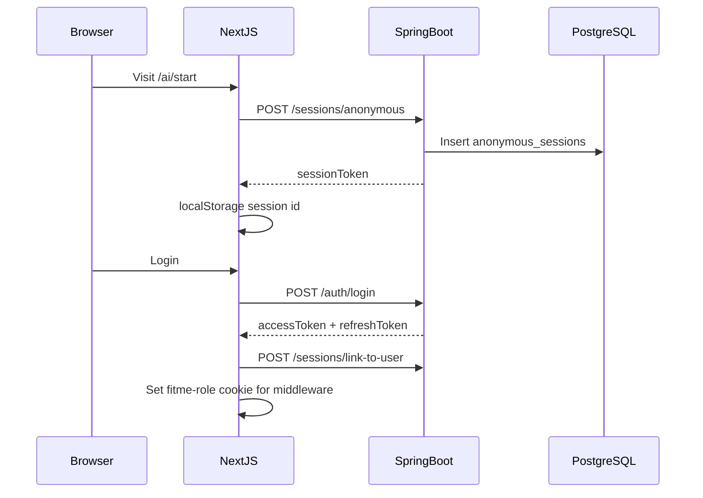

# FitMe AI — Architecture Overview

## System context

```
Browser → Next.js (frontend :3000) → rewrite /api/v1 → Spring Boot (backend :8080) → PostgreSQL
```

- **Anonymous users:** `X-Anonymous-Session` header from localStorage
- **Authenticated users:** `Authorization: Bearer <JWT>` + optional session header
- **Portals:** Brand (`/brand/*`), Admin (`/admin/*`) — RBAC via JWT role + Next.js middleware cookie `fitme-role`

## Frontend layers

```
app/                    Route pages (App Router)
  ├── page.tsx          Marketing home (custom full-bleed layout)
  ├── ai/               AI consultation wizard
  ├── try-on/           Virtual try-on flow (tiêu thụ Fitken khi generate AI)
  ├── pricing/          Bảng giá consumer: Free vs FitMe Pro 49k/tháng
  ├── billing/return/   Xác nhận thanh toán PayOS gói Pro
  ├── rewards/          Trang Nhận thưởng (điểm danh, chia sẻ, đánh giá)
  ├── cart/ checkout/   Giỏ hàng & thanh toán COD / PayOS
  ├── orders/           Lịch sử đơn hàng, chi tiết & tracking vận đơn
  ├── profile/          Hồ sơ, địa chỉ giao hàng (`addresses`), thư viện ảnh (`gallery`)
  ├── auth/             Login / register / password reset
  ├── brand/            Seller portal: catalog, đơn hàng (`orders`), đối soát (`settlements`)
  ├── admin/            Admin portal: duyệt brand/SP, đơn hàng, đối soát, rewards, reviews, plans
  └── ...

components/
  ├── ui/               Radix primitives (button, card, input, chip…)
  ├── layout/           App chrome
  │   ├── Header Footer           Consumer nav
  │   ├── PortalLayout            Brand/Admin sidebar shell
  │   ├── PageShell PageHeader    Consumer page scaffolding
  │   ├── FlowStepper             Read-only wizard progress
  │   ├── AuthCardShell           Auth card + logo
  │   └── PortalLoginShell        Brand/Admin login
  ├── common/           EmptyState, ProductCard, LoadingSkeleton…
  ├── tryon/            TryOnVariantShell
  └── brand/ product/   Domain-specific forms

services/               HTTP clients → backend /api/v1
stores/                 Zustand (auth, session, consultation, tryon)
hooks/                  use-ensure-session, use-auth-redirect, use-tryon-variant
types/                  TypeScript domain types
lib/design-tokens.ts    Presentational class constants
```

### Layout conventions

| Context | Wrapper | Max width |
|---------|---------|-----------|
| Consumer flow pages | `PageShell` + `PageHeader` | narrow (xl), medium (2xl), wide (4xl/7xl) |
| Marketing home | Custom sections | full-bleed hero |
| Auth | `AuthCardShell` | max-w-md centered |
| Brand/Admin portal | `PortalLayout` | max-w-7xl inside sidebar layout |

**Do not change** `h1` text, button labels, or form field `id`/`label` when restyling — E2E tests depend on them.

## Backend layers

```
com.fitme/
  ├── fitken/           Ví Fitken (TRIAL, CHECKIN, SHARE, REVIEW, TRY_ON_SPEND), ledger
  ├── billing/          Consumer subscription (FitMe Pro 49k/tháng), BillingPlan, PayOS webhook
  ├── rewards/          Điểm danh chuỗi 3 ngày, nộp link chia sẻ mạng xã hội
  ├── review/           Đánh giá sản phẩm có ảnh, verified purchase verification
  ├── gallery/          Thư viện ảnh outfit cá nhân (`outfit_gallery_images`)
  ├── cart/             Giỏ hàng gom nhóm theo thương hiệu
  ├── address/          Sổ địa chỉ nhận hàng người dùng
  ├── order/            Đơn khách (COD/PayOS), tách đơn seller, tạo shipment, tracking
  ├── settlement/       Đối soát doanh thu seller, hoa hồng sàn 10%, quyết toán chuyển khoản
  ├── logistics/        Webhook cập nhật trạng thái vận đơn từ carrier (GHN/GHTK/ViettelPost)
  ├── voucher/          Cấp và áp dụng voucher freeship hàng tháng của gói Pro
  ├── entitlement/      Phân tầng Free vs Pro (coherence modes PREFER/STRICT)
  ├── product/          Catalog sản phẩm, biến thể tồn kho, kiểm duyệt admin
  ├── brand/            Brand profile, seller portal orders/shipments/payout
  ├── recommendation/   Gợi ý phối đồ AI (hybrid rule + Gemini Flash)
  ├── tryon/            Lifecycle thử đồ ảo (tiêu 1 Fitken/lượt AI)
  ├── preview/          Upload ảnh người dùng, gọi microservice VTON (FASHN/HF)
  ├── auth/ session/    JWT, xác thực email, liên kết phiên ẩn danh
  ├── privacy/          Consent, yêu cầu xóa dữ liệu (GDPR/PDPA)
  ├── storage/          Lưu trữ file local / Cloudflare R2
  └── common/           Security, config (FitMeProperties), ApiResponse envelope, exception
```

### B2C Core & Commerce Subsystems

1. **Fitken Tokenomics & Try-on**:
   - 1 Fitken = 1 lượt thử đồ AI (`USER_PHOTO` / `AVATAR`). `OUTFIT_BOARD_ONLY` miễn phí.
   - Ví gồm 2 ngăn: `subscription_remaining` (từ gói Pro, reset về 0 khi hết hạn) và `bonus_remaining` (tặng 5 Fitken dùng thử lần đầu, điểm danh, chia sẻ, đánh giá, admin cấp — không hết hạn). Tiêu ngăn subscription trước.
   - Trừ Fitken lúc bắt đầu generate; hoàn lại nếu kết quả thất bại hoặc dùng ảnh fallback minh họa.
2. **Gói FitMe Pro**:
   - 49.000đ/tháng qua PayOS checkout: +15 Fitken vào ngăn subscription, +2 voucher FREESHIP (giảm tối đa 30.000đ/voucher).
   - Tự động đồng bộ quyền lợi Pro (`plus_coherence_mode = PREFER/STRICT`).
3. **Thương mại điện tử & Seller Portal**:
   - Đơn hàng người dùng (`orders`) hỗ trợ thanh toán COD hoặc PayOS. Khi đặt hàng, đơn được tự động tách thành các **đơn seller** (`seller_orders`) theo từng brand.
   - Quản lý vận đơn (`shipments`) với carrier (GHN, GHTK, VIETTEL_POST, SELF), cập nhật qua seller portal hoặc logistics webhook (`POST /api/v1/webhooks/logistics`).
   - Đối soát seller (`seller_settlements`): đơn hoàn thành sau 7 ngày đổi trả (`settlement-hold-days`) đủ điều kiện đối soát. Hoa hồng sàn 10% trên subtotal.
4. **Nhận thưởng & Đánh giá**:
   - Điểm danh chuỗi 3 ngày liên tiếp: +1 Fitken (`CHECKIN_REWARD`).
   - Chia sẻ bài đăng mạng xã hội: +2 Fitken (`SHARE_REWARD`), tối đa 1 lần/ngày, admin có thể duyệt/từ chối.
   - Đánh giá sản phẩm có ảnh (≥20 ký tự, ≥1 ảnh): +3 Fitken (`REVIEW_REWARD`).

### Recommendation pipeline

```
RecommendationController
  → RecommendationService (orchestration)
      → WardrobeBlendService
      → OutfitScoringService
      → OutfitCompositionService
      → SizeResolutionService
```

*Lưu ý:* `ProductEligibilityService` lọc sản phẩm ACTIVE, còn hàng (IN_STOCK) và có ảnh; không còn ràng buộc quota theo brand.

### Admin surface

```
AdminController → AdminRuleService, BrandService, RedirectService, PrivacyService
                → AdminFlaggedLinkService, AdminPreviewMonitoringService
AdminOrderController → Giám sát đơn hàng toàn sàn
AdminSettlementController → Tổng quan GMV/hoa hồng, tạo & quyết toán kỳ đối soát seller
AdminFitkenController → Quản lý số dư & điều chỉnh Fitken người dùng
AdminRewardController → Duyệt / từ chối link chia sẻ nhận thưởng
AdminReviewController → Kiểm duyệt & ẩn đánh giá sản phẩm
AdminBillingController → Quản lý danh mục gói Pro (fitkenAmount, freeshipVouchers...)
AdminProductController → Kiểm duyệt sản phẩm của brand
```

All responses use `ApiResponse<T>`: `{ success, data, error?, message? }`.

## Auth & session flow


```mermaid
sequenceDiagram
  participant Browser
  participant FE as NextJS
  participant BE as SpringBoot
  participant DB as PostgreSQL

  Browser->>FE: Visit /ai/start
  FE->>BE: POST /sessions/anonymous
  BE->>DB: Insert anonymous_sessions
  BE-->>FE: sessionToken
  FE->>FE: localStorage session id

  Browser->>FE: Login
  FE->>BE: POST /auth/login
  BE-->>FE: accessToken + refreshToken
  FE->>BE: POST /sessions/link-to-user
  FE->>FE: Set fitme-role cookie for middleware
```

## Database

- Flyway migrations: `backend/src/main/resources/db/migration/` (V1 → V19)
- `V1__init_schema.sql` — schema khởi tạo ban đầu
- `V17__user_vouchers.sql` — bảng voucher người dùng (`user_vouchers`)
- `V18__b2c_fitken.sql` — drop bảng billing brand cũ, chuyển đổi `billing_plans` sang gói consumer, ví & ledger Fitken, consumer subscription & order, điểm danh, chia sẻ, đánh giá, thư viện ảnh
- `V19__commerce.sql` — tồn kho biến thể, địa chỉ người dùng, giỏ hàng, đơn hàng khách, đơn seller, vận đơn, đối soát seller
- Hibernate `ddl-auto: validate` (schema owned by Flyway)

## Testing pyramid

| Layer | Tool | Location |
|-------|------|----------|
| Backend unit/integration | JUnit 5 + MockMvc + Testcontainers | `backend/src/test/` |
| Frontend unit | Vitest + Testing Library | `frontend/src/**/*.test.ts(x)` |
| E2E | Playwright | `frontend/e2e/` |
| CI | GitHub Actions | `.github/workflows/ci.yml` |
| Local all-flows | `scripts/test-flows.ps1` | Windows |

## CI pipeline

1. **backend-test** — `mvn test` (Testcontainers PostgreSQL)
2. **frontend-unit** — `npm test`
3. **frontend-build** — `npm run build`
4. **e2e** — Postgres service + Spring Boot + Playwright (`smoke-routes` + `role-flows`)

See also: [`API_CONTRACT.md`](API_CONTRACT.md), [`QA_REPORT.md`](QA_REPORT.md), [`USER_GUIDE.md`](USER_GUIDE.md), [`DEVELOPER_GUIDE.md`](DEVELOPER_GUIDE.md).
