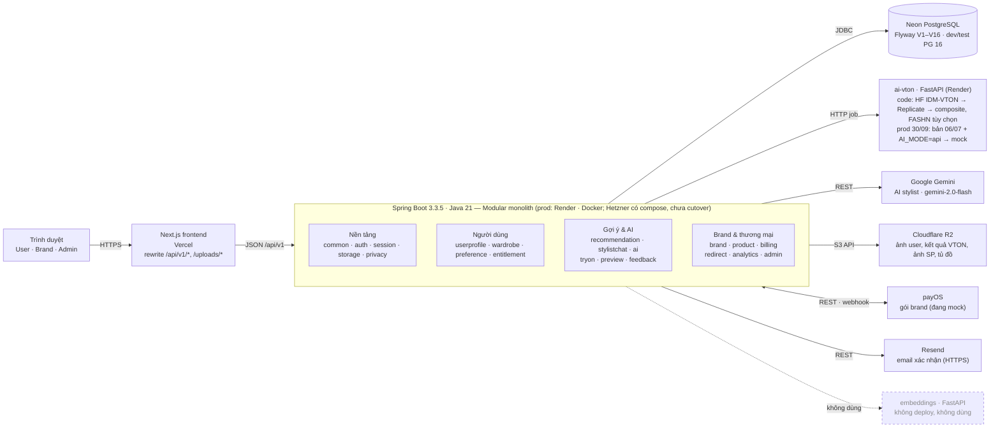
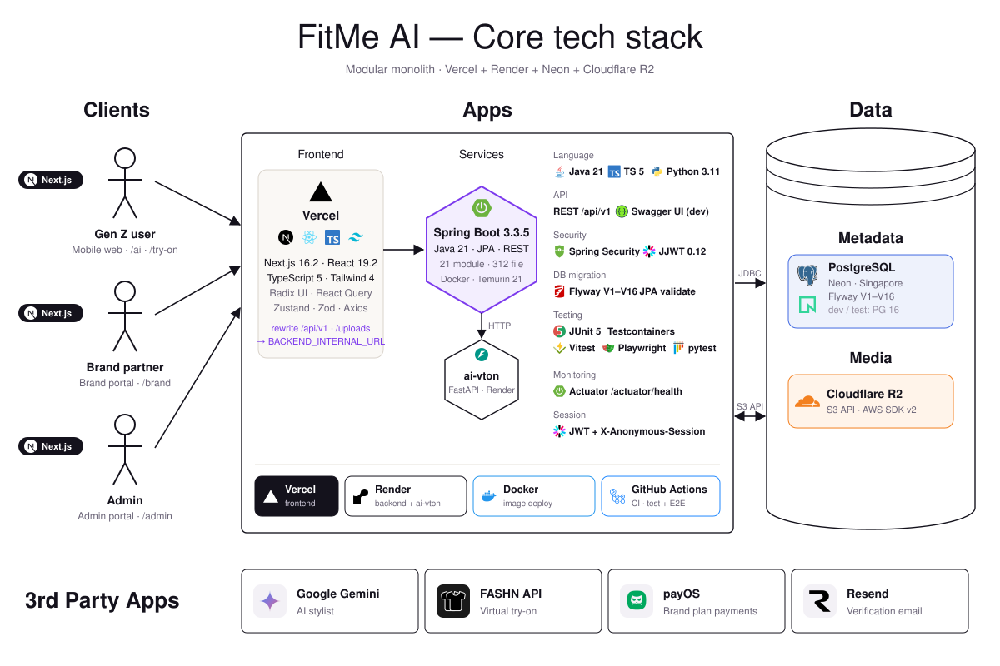
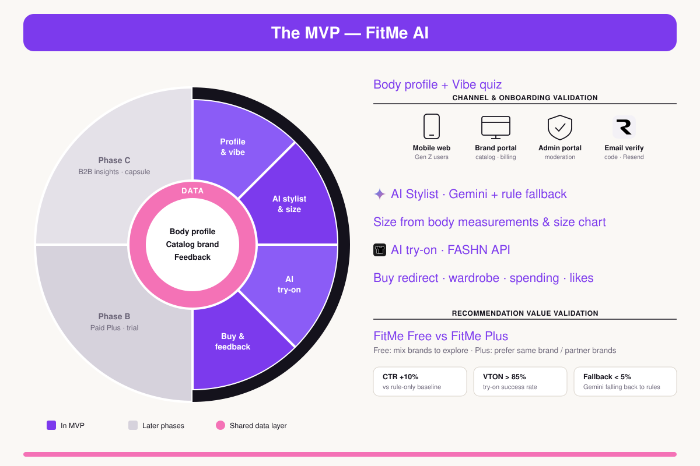
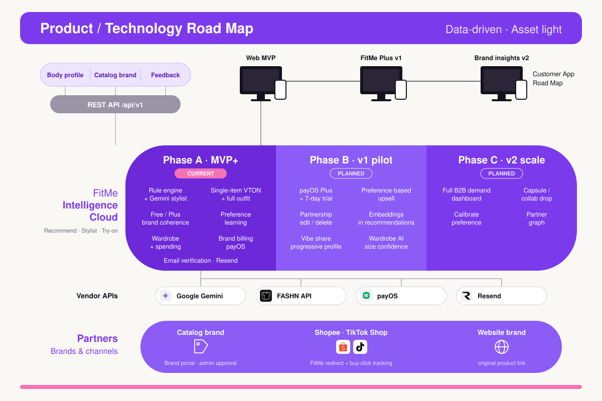
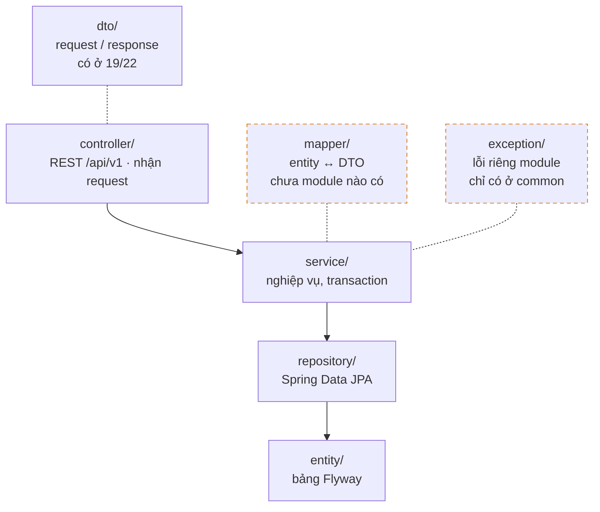
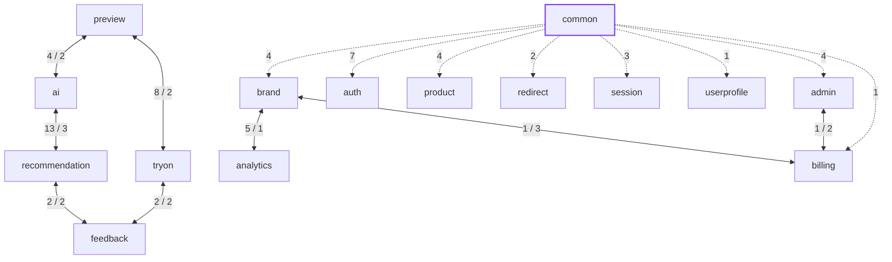

# Phần 3 · Kiến trúc backend: đề xuất và thực tế

> **Lưu ý:** Dự án đã chuyển đổi mô hình kinh doanh sang B2C (FitMe Pro 49k/tháng, Fitken, in-app commerce, brand dashboard free) theo [`docs/B2C_PIVOT_PLAN.md`](./B2C_PIVOT_PLAN.md).

Đối chiếu [`FitMe_AI_BACKEND_DEVELOPMENT_GUIDE.md`](../FitMe_AI_BACKEND_DEVELOPMENT_GUIDE.md) mục 3 với code `backend/src/main/java/com/fitme` tại commit `50de105`, kiểm tra ngày 28/09/2026.

| Chỉ số | Giá trị |
|---|---|
| Module: đề xuất → thực tế | 16 → 21 |
| File Java | 312 |
| Controller gọi thẳng repository | 0 / 26 |
| Cặp module phụ thuộc hai chiều | 8 |

> **Kết luận.** Dự án đi đúng hướng modular monolith: đủ 16/16 module đề xuất, controller không chạm repository, schema do Flyway quản lý. Điểm yếu là ranh giới module lỏng: 8 cặp phụ thuộc vòng, `common` import ngược vào module nghiệp vụ, và cấu trúc lớp `mapper/` và `exception/` của mục 3 chưa được áp dụng.

---

## 3.0 Bối cảnh hệ thống

Mục 3 chỉ mô tả bên trong backend. Sơ đồ này đặt backend vào hệ thống đang deploy (theo `README.md`, `docker-compose.hetzner.yml`, `render.yaml`, `frontend/next.config.ts`, `application.yml`).



Auth: `Authorization: Bearer <JWT>` + `X-Anonymous-Session`. Mọi response bọc trong `ApiResponse<T>`.

Kiểm tra prod ngày 30/09/2026: `/api/v1` qua Vercel trả header `Rndr-Id` (backend chạy trên Render). `fitme-ai-vton.onrender.com/health` trả `mode: api` và thiếu trường `fashn_api_configured`, khớp code commit `9c1a61a` (06/07). Ở bản đó `AI_MODE=api` rơi vào `MockVtonProvider`. Catalog trả 36 sản phẩm: ảnh tĩnh `/catalog/products` trên Vercel, link mua Shopee do seeder tự sinh, không brand nào có link TikTok Shop.

Sơ đồ trực quan (sinh lại bằng `python docs/diagrams/build_diagrams.py`):





---

## 3.1 Cây module: modular monolith

Module **in đậm** là module có trong code nhưng không có trong đề xuất.

| Nền tảng | Người dùng | Gợi ý & AI | Brand & thương mại |
|---|---|---|---|
| `common` — 59 file | `userprofile` — 11 | `recommendation` — 19 | `brand` — 14 |
| `auth` — 17 | `wardrobe` — 6 | **`stylistchat`** — 12 | `product` — 24 |
| `session` — 6 | **`preference`** — 3 | **`ai`** — 11 | **`billing`** — 29 |
| `storage` — 9 | **`entitlement`** — 4 | `tryon` — 17 | `redirect` — 12 |
| `privacy` — 8 | | `preview` — 19 | `analytics` — 9 |
| `config` — rỗng | | `feedback` — 4 | `admin` — 18 |

---

## 3.2 Lớp chuẩn trong mỗi module

### Đề xuất



### Thực tế theo từng module

`có` = có package · `sai chỗ` = có nhưng nằm sai vị trí · `—` = không có

| Module | ctrl | svc | repo | entity | dto | mapper | exc | Ghi chú |
|---|:-:|:-:|:-:|:-:|:-:|:-:|:-:|---|
| `admin` | có | có | có | có | có | sai chỗ | — | AdminDtoMapper nằm trong service/ |
| `ai` | — | sai chỗ | — | — | có | — | — | client/, 6 file ở gốc, vton/ rỗng |
| `analytics` | — | có | có | có | có | — | — | API nằm ở brand/admin |
| `auth` | có | có | có | có | có | — | — | |
| `billing` | có | có | có | có | có | sai chỗ | — | payos/, BillingDtoMapper trong service/ |
| `brand` | có | có | có | có | có | — | — | |
| `common` | — | — | — | — | có | — | có | config/, security/, enums/, util/, health/ |
| `config` | — | — | — | — | — | — | — | package rỗng |
| `entitlement` | có | có | — | — | có | — | — | |
| `feedback` | — | có | có | có | có | — | — | API nằm ở recommendation/tryon |
| `preference` | — | có | có | có | — | — | — | |
| `preview` | có | có | có | có | có | — | — | |
| `privacy` | có | có | có | có | có | — | — | |
| `product` | có | có | có | có | có | — | — | util/ |
| `recommendation` | có | có | có | có | có | — | — | |
| `redirect` | có | có | có | có | có | — | — | |
| `session` | có | có | có | có | có | — | — | |
| `storage` | sai chỗ | sai chỗ | — | — | — | — | — | 9 file phẳng, không chia lớp |
| `stylistchat` | có | có | có | có | có | — | — | |
| `tryon` | có | có | có | có | có | — | — | support/ |
| `userprofile` | có | có | có | có | có | — | — | |
| `wardrobe` | có | có | có | có | có | — | — | |

---

## 3.3 Ví dụ module product

Dòng `-`: đề xuất nhưng code không có. Dòng `+`: code có nhưng đề xuất không nhắc. Còn lại: khớp. Tổng: +15 / −1.

```diff
  product/
    controller/ProductController.java
    controller/BrandProductController.java
    controller/AdminProductController.java
    service/ProductService.java
    service/ProductEligibilityService.java
+   service/ProductAudienceService.java
    repository/ProductRepository.java
+   repository/ProductImageRepository.java
+   repository/ProductTagRepository.java
+   repository/ProductVariantRepository.java
+   repository/SizeChartRepository.java
    entity/Product.java
+   entity/ProductImage.java
+   entity/ProductTag.java
+   entity/ProductVariant.java
+   entity/SizeChart.java
    dto/ProductResponse.java
    dto/CreateProductRequest.java
+   dto/FlagProductRequest.java
+   dto/ProductImageDto.java
+   dto/ProductTagDto.java
+   dto/ProductVariantDto.java
+   dto/SizeChartDto.java
-   mapper/ProductMapper.java
+   util/ProductCategoryGroups.java
```

---

## Phụ thuộc giữa các module

Mục 4.1 yêu cầu modular monolith có ranh giới rõ. Dữ liệu dựng từ các lệnh `import com.fitme.*` trong code. `A → B` nghĩa là A import class của B; số trên cạnh là số lệnh import. Không vẽ cạnh X → common (mọi module đều dùng common).

### Vòng phụ thuộc và import ngược của common

Nhãn `x / y` trên cạnh hai chiều: x lệnh import theo chiều trái → phải, y lệnh theo chiều ngược lại. Cạnh nét đứt là `common` import vào module nghiệp vụ.



### 8 cặp phụ thuộc hai chiều

| Cặp | Chiều thứ nhất | Chiều ngược lại |
|---|---|---|
| preview ↔ tryon | `VtonTryOnService` dùng `TryOnRequestRepository` | `TryOnService` dùng `VtonTryOnService` |
| preview ↔ ai | `VtonTryOnService` dùng `AiVtonClient` | `VtonImageUrlResolver` dùng `PhotoUploadService` |
| ai ↔ recommendation | `GeminiStylistService` dùng `SizeResolutionService` | `RecommendationService` dùng `GeminiStylistService` |
| recommendation ↔ feedback | `RecommendationController` dùng `FeedbackService` | `FeedbackService` dùng `RecommendationRepository` |
| tryon ↔ feedback | `TryOnController` dùng `FeedbackService` | `FeedbackService` dùng `TryOnRequestRepository` |
| brand ↔ analytics | `BrandDashboardController` dùng `AnalyticsService` | `AnalyticsService` dùng `BrandRepository` |
| brand ↔ billing | `BrandDashboardController` dùng `BrandQuotaService` | `BrandBillingService` dùng `BrandRepository` |
| admin ↔ billing | `AdminBrandListService` dùng `BrandBillingService` | `AdminBillingController` dùng `AdminBrandListService` |

<details>
<summary>Toàn bộ phụ thuộc giữa module (module → module: số lệnh import)</summary>

| Module | Import từ |
|---|---|
| admin | analytics 2, billing 1, brand 6, entitlement 2, preview 2, privacy 3, redirect 6 |
| ai | brand 2, preview 2, product 11, recommendation 13, storage 2, tryon 3, userprofile 5, wardrobe 2 |
| analytics | auth 1, brand 1, product 2, redirect 3 |
| billing | admin 2, brand 3, product 3 |
| brand | analytics 5, auth 2, billing 1, storage 1 |
| common | admin 4, auth 7, billing 1, brand 4, product 4, redirect 2, session 3, userprofile 1 |
| entitlement | auth 2 |
| feedback | analytics 1, preference 1, recommendation 2, tryon 2 |
| preference | product 2, recommendation 2 |
| preview | ai 4, analytics 2, billing 1, privacy 1, product 2, recommendation 2, storage 6, tryon 8 |
| product | billing 1, brand 4, userprofile 1 |
| recommendation | ai 3, analytics 1, brand 4, entitlement 1, feedback 2, preference 1, product 20, userprofile 10, wardrobe 5 |
| redirect | analytics 1, brand 2, preference 1, product 6 |
| session | recommendation 4, tryon 2, userprofile 4, wardrobe 2 |
| stylistchat | ai 1, recommendation 7, userprofile 5 |
| tryon | analytics 1, billing 1, brand 1, feedback 2, preview 2, product 5, recommendation 4, userprofile 4 |
| wardrobe | privacy 1, storage 1 |
| auth, storage, privacy, userprofile | chỉ phụ thuộc common |

</details>

---

## Phát hiện và hướng xử lý

| Mức | Phát hiện | Bằng chứng | Hướng xử lý |
|---|---|---|---|
| **Cao** | 8 cặp module phụ thuộc hai chiều, trái nguyên tắc modular monolith ở mục 4.1 | Xem bảng 8 cặp ở trên | Chọn một chiều. Ví dụ: `tryon` sở hữu `TryOnRequest` và gọi `preview` qua interface; `feedback` chỉ nhận id, controller gọi feedback thay vì feedback đọc repository của module khác |
| **Cao** | `common` import ngược vào 8 module nghiệp vụ | `SeedDataLoader`, `FashionCatalogSeeder` (admin, auth, billing, brand, product, redirect); security filter dùng repository của auth/session; `GenderAffinity` dùng `BodyProfile` | Chuyển seeder sang package `seed/` riêng; chuyển `UserDetailsServiceImpl`, `JwtService` về `auth`; `AnonymousSessionFilter` về `session` |
| Trung bình | Không module nào có `mapper/` hay `exception/` như mục 3 yêu cầu | Chỉ 2 DTO mapper, nằm trong `service/` (`AdminDtoMapper`, `BillingDtoMapper`). Lỗi dùng chung `common/exception` | Hoặc sửa tài liệu cho khớp (map trong service, lỗi dùng chung), hoặc tách `mapper/` cho module lớn: product, recommendation, billing |
| Trung bình | Module `ai` là adapter nhưng chứa logic nghiệp vụ gợi ý | `ai` import recommendation 13 lần, product 11 lần (`GeminiStylistService`, `StylistContextBuilder`, `GeminiOutfitValidator`) | Giữ `ai/client` (Gemini, VTON) làm hạ tầng; đưa phần xây prompt/validate outfit về `recommendation` |
| Thấp | `storage` không chia lớp | 9 file phẳng; `UploadResourceController` (`GET /uploads/**`) nằm lẫn với `LocalStorageService`, `R2StorageService` | Tách `controller/` và `service/` giống các module khác |
| Thấp | Package rỗng | `com.fitme.config` và `ai/vton` không có file nào | Xóa |
| Thấp | Code chết: `EmbeddingClient` | Không class nào gọi `EmbeddingClient`; service embeddings không có trong `render.yaml` hay `docker-compose` | Xóa, hoặc đưa vào roadmap AI có kế hoạch deploy |
| Thấp | Tài liệu kiến trúc lỗi thời | `docs/ARCHITECTURE.md` nhắc `RecommendationMapper` (không tồn tại), chỉ liệt kê V1–V2 (thực tế V1–V16, thiếu V5); mục 3 thiếu ai, billing, entitlement, preference, stylistchat | Cập nhật cây module trong mục 3 và `ARCHITECTURE.md` theo code hiện tại |

### Điểm đang làm đúng

- Cả 26 controller đều không import repository.
- Mọi response dùng `ApiResponse<T>`.
- Schema do Flyway sở hữu; JPA chỉ `validate`.
- AI nặng (VTON) đã tách thành service Python riêng, đúng tinh thần mục 4.1 là chỉ tách khi thực sự cần.

---

*Nguồn: quét thư mục và lệnh import trong `backend/src/main/java/com/fitme`, `render.yaml`, `frontend/next.config`, `application.yml` · commit `50de105`.*
