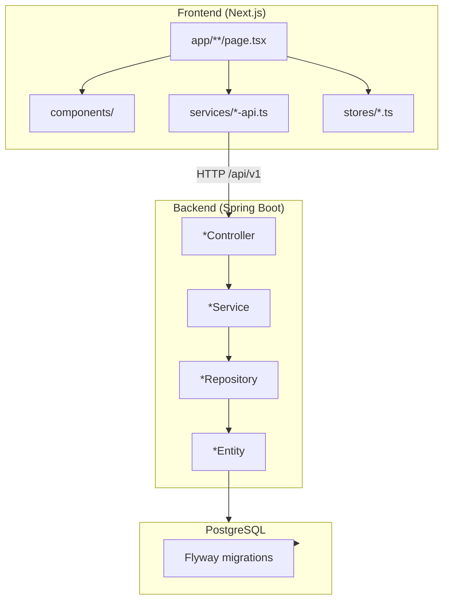
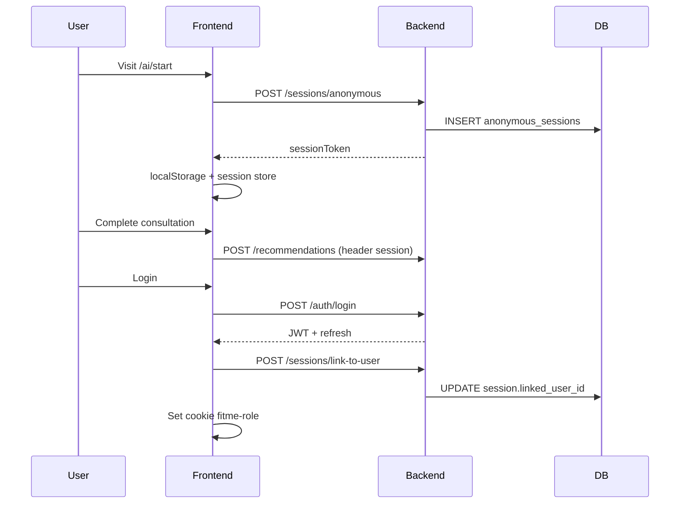

# FitMe AI — Hướng dẫn phát triển (Developer Guide)

Tài liệu onboarding cho **developer mới** — giải thích kiến trúc, cấu trúc code, luồng dữ liệu, quy ước và cách mở rộng hệ thống an toàn.

> Đọc kèm: [ARCHITECTURE.md](ARCHITECTURE.md) (tóm tắt), [API_CONTRACT.md](API_CONTRACT.md) (endpoint map), [USER_GUIDE.md](USER_GUIDE.md) (demo theo role).

---

## 1. Tổng quan hệ thống

### 1.1 Mục tiêu sản phẩm

FitMe AI là web app tư vấn thời trang:

- Gợi ý outfit, size, form, màu theo profile người dùng
- Preview 2D / try-on minh họa (không cam kết giống thật 100%)
- Chuyển hướng mua hàng qua kênh ngoài (Shopee, TikTok Shop, website brand)
- Portal brand quản lý catalog + analytics tổng hợp
- Portal admin vận hành moderation & rules

**Không thuộc MVP:** thanh toán, đơn hàng, logistics, upload ảnh SP lên cloud storage.

### 1.2 Stack

| Layer | Tech | Thư mục |
|-------|------|---------|
| Frontend | Next.js 16 App Router, TS, Tailwind 4, TanStack Query, Zustand | `frontend/` |
| Backend | Java 21, Spring Boot 3.3, JPA, Flyway | `backend/` |
| Database | PostgreSQL 16 | Docker / Neon |
| Auth | JWT (access + refresh), anonymous session header | |
| Test | JUnit + Testcontainers, Vitest, Playwright | |
| CI | GitHub Actions | `.github/workflows/ci.yml` |

### 1.3 Luồng request

```
Browser
  → Next.js (:3000)
      rewrite /api/v1/* → Spring Boot (:8080)
  → PostgreSQL
```

File cấu hình proxy: `frontend/next.config.ts` — biến `BACKEND_INTERNAL_URL` (Docker/production).

---

## 2. Kiến trúc logic

### 2.1 Sơ đồ thành phần



### 2.2 Domain modules (backend)

Package gốc: `com.fitme`

| Package | Trách nhiệm |
|---------|-------------|
| `session` | Anonymous session, link-to-user |
| `auth` | Register, login, refresh, reset password |
| `userprofile` | Body/style profile (`/me`) |
| `wardrobe` | Tủ đồ cá nhân |
| `product` | Catalog public + brand CRUD + admin moderation |
| `brand` | Brand entity, application, dashboard analytics |
| `recommendation` | Pipeline gợi ý outfit AI |
| `tryon` | Try-on request lifecycle |
| `preview` | Photo upload + preview generation |
| `redirect` | Buy click tracking + redirect URL |
| `feedback` | User feedback on recommendations |
| `privacy` | Consent, deletion requests |
| `analytics` | Aggregated metrics (brand/admin) |
| `admin` | Rules, flagged links, privacy admin, monitoring |
| `storage` | Local file storage (`./uploads`) |
| `common` | Security, config, enums, exceptions, seed |

### 2.3 Controllers map

| Controller | Prefix | Role guard |
|------------|--------|------------|
| `SessionController` | `/api/v1/sessions` | Public |
| `AuthController` | `/api/v1/auth` | Public |
| `ProfileController` | `/api/v1/me` | Session or auth (filter) |
| `WardrobeController` | `/api/v1/wardrobe` | Session or auth |
| `ProductController` | `/api/v1/products` | GET public |
| `BrandPublicController` | `/api/v1/brands` | GET public |
| `RecommendationController` | `/api/v1/recommendations` | Mostly public/session |
| `TryOnController` | `/api/v1/try-on/requests` | Session |
| `PhotoUploadController` | `/api/v1/uploads` | Session |
| `PreviewController` | `/api/v1/previews` | Session |
| `RedirectController` | `/api/v1/redirects` | Public |
| `PrivacyController` | `/api/v1/privacy` | Auth |
| `BrandProductController` | `/api/v1/brand/products` | `BRAND_OWNER` |
| `BrandDashboardController` | `/api/v1/brand` | `BRAND_OWNER` |
| `BrandApplicationController` | `/api/v1/brand/applications` | Authenticated USER |
| `AdminController` | `/api/v1/admin` | `ADMIN` |
| `AdminProductController` | `/api/v1/admin/products` | `ADMIN` |
| `TestAuthController` | `/api/v1/test` | Test-only helpers |

Chi tiết field JSON: Swagger `http://localhost:8080/swagger-ui.html` hoặc [API_CONTRACT.md](API_CONTRACT.md).

---

## 3. Frontend — cấu trúc & quy ước

### 3.1 Thư mục quan trọng

```
frontend/src/
├── app/                    # App Router — 1 folder = 1 route
│   ├── page.tsx            # Marketing home (layout riêng)
│   ├── ai/                 # Wizard tư vấn AI
│   ├── try-on/             # Virtual try-on
│   ├── discover/           # Catalog + search
│   ├── auth/               # Login/register/reset
│   ├── brand/ admin/       # Portal (PortalLayout)
│   ├── profile/            # User profile + privacy
│   └── api/auth/session/   # Route handler set cookie role
├── components/
│   ├── ui/                 # Radix + shadcn-style primitives
│   ├── layout/             # Shells (PageShell, Header, FlowStepper…)
│   ├── common/             # ProductCard, EmptyState…
│   ├── brand/ product/ tryon/
├── services/               # Axios clients → /api/v1
├── stores/                 # Zustand global state
├── hooks/                  # use-ensure-session, use-auth-redirect…
├── types/                  # Domain TS types
├── lib/design-tokens.ts    # Class constants
└── middleware.ts           # RBAC route guard (brand/admin)
```

### 3.2 Layout system

| Ngữ cảnh | Component | Ghi chú |
|----------|-----------|---------|
| Consumer pages | `PageShell` + `PageHeader` | Props `width`: narrow/medium/wide |
| **Mobile consumer** | `ConsumerChrome` + `MobileBottomNav` | Bottom nav `< md`; logic trong `lib/mobile-chrome.ts` |
| Sticky filter (discover) | `StickyToolbar` | Inline Tailwind, `top-16` dưới header |
| Auth pages | `AuthCardShell` | Card centered max-w-md |
| Brand/Admin | `PortalLayout` | Sidebar + content |
| AI/Try-on wizard | `FlowStepper` | Read-only progress |
| Try-on variants | `TryOnVariantShell` | Size/form/color/decision |

**Quy tắc quan trọng:** Khi restyle UI, **không đổi** text `h1`, label button, `id`/`label` form field — E2E Playwright dựa vào accessible name.

#### Mobile consumer chrome

- [`ConsumerChrome.tsx`](frontend/src/components/layout/ConsumerChrome.tsx) — bọc Header, main (`pb-mobile-nav`), Footer, `MobileBottomNav`
- [`mobile-chrome.ts`](frontend/src/lib/mobile-chrome.ts) — `shouldShowBottomNav()`, `isCompactHeader()`, `getActiveMobileNavTab()`
- Bottom nav **ẩn** trên auth, portal, redirect, wizard AI/try-on (xem danh sách trong file)
- Header mobile compact: logo + quick search (không hamburger khi bottom nav hiện)
- CSS: `.pb-mobile-nav`, `--mobile-nav-height`, `env(safe-area-inset-bottom)` trong [`globals.css`](frontend/src/app/globals.css)
- E2E mobile: `e2e/mobile-nav.spec.ts` — project Playwright `mobile-chrome` (iPhone 13)

**Khi thêm trang consumer mới:** cập nhật `shouldShowBottomNav` nếu trang cần ẩn/hiện bottom nav; đảm bảo CTA cuối trang không bị nav che (`pb-mobile-nav` trên main hoặc section cuối).

### 3.3 State management

| Store | File | Nội dung |
|-------|------|----------|
| Auth | `stores/auth-store.ts` | accessToken, refreshToken, user |
| Session | `stores/session-store.ts` | anonymous session token |
| Consultation | `stores/consultation-store.ts` | Wizard draft (body/style/occasion) |
| Try-on | `stores/tryon-store.ts` | Selected products, measurements |

Hydration SSR: `components/StoreHydration.tsx` — rehydrate Zustand sau mount.

### 3.4 API client

`services/api-client.ts`:

- Base URL: `/api/v1` (relative — qua Next rewrite)
- Tự gắn `Authorization: Bearer …` từ auth store
- Tự gắn `X-Anonymous-Session` từ session store
- Interceptor refresh token khi 401

Mỗi domain có file riêng: `auth-api.ts`, `product-api.ts`, `recommendation-api.ts`, …

### 3.5 Routing & RBAC (frontend)

`middleware.ts` — chỉ match `/brand/*`, `/admin/*`:

- Cookie `fitme-role` set sau login qua `app/api/auth/session/route.ts`
- Giá trị: `USER`, `BRAND`, `ADMIN` (map từ backend `UserRole`)
- Public paths: `/brand/login`, `/brand/onboarding`, `/brand/pending`, `/admin/login`

**Lưu ý:** Middleware là guard UX — backend vẫn enforce JWT role.

### 3.6 Data fetching

TanStack Query (`providers.tsx`) cho server state:

```tsx
const { data } = useQuery({
  queryKey: ["products", filters],
  queryFn: () => productApi.list(filters),
});
```

Wizard flows thường dùng Zustand + POST trực tiếp qua service.

---

## 4. Backend — cấu trúc & quy ước

### 4.1 Layer pattern

Mỗi domain tuân theo:

```
controller/   @RestController, validation, HTTP status
service/      business logic, @Transactional
repository/   Spring Data JPA
entity/       @Entity
dto/          Java records cho request/response
```

Response envelope thống nhất — `common/dto/ApiResponse.java`:

```json
{ "success": true, "data": { ... }, "error": null, "message": null }
```

Exception → `GlobalExceptionHandler` → HTTP 4xx/5xx + message.

### 4.2 Security pipeline

Filter chain (`SecurityConfig.java`):

1. `AnonymousSessionFilter` — đọc header `X-Anonymous-Session`
2. `JwtAuthenticationFilter` — parse Bearer JWT
3. `SessionOrAuthFilter` — gắn request context (userId hoặc sessionId)

Role mapping Spring Security:

- Backend enum `UserRole.BRAND_OWNER` → authority `ROLE_BRAND_OWNER`
- `@PreAuthorize` / `hasRole("ADMIN")` trên admin endpoints

`OwnershipChecker` — verify brand owner chỉ sửa SP của mình.

### 4.3 Recommendation pipeline (đã tách service)

```
RecommendationController
  └── RecommendationService (orchestrator)
        ├── WardrobeBlendService      # Blend wardrobe items vào outfit
        ├── OutfitScoringService      # Score candidate products
        ├── OutfitCompositionService  # Compose final outfit
        ├── SizeResolutionService     # Map body → size chart
        └── RecommendationMapper      # Entity → DTO
```

Khi sửa logic gợi ý: ưu tiên sửa service con, giữ orchestrator mỏng.

### 4.4 Admin surface (đã tách)

```
AdminController
  ├── AdminRuleService
  ├── AdminFlaggedLinkService
  ├── AdminPreviewMonitoringService
  ├── BrandService (approve brand)
  └── PrivacyService (admin view)

AdminProductController → ProductService.moderate()
```

Admin DTOs tách riêng (`StyleRuleDto`, `ConsentRecordDto`, …) — không expose entity trực tiếp.

### 4.5 Database & migrations

- Flyway: `backend/src/main/resources/db/migration/`
- `V1__init_schema.sql` — ~24 bảng (users, sessions, profiles, brands, products, recommendations, try_on, redirects, rules…)
- `V2__auth_tokens.sql` — refresh token revocations
- Hibernate `ddl-auto: validate` — **không** auto DDL

**Quy tắc migration:**

- Không sửa file migration đã chạy trên production — tạo `V3__...sql` mới
- Local dev DB cũ: drop DB hoặc `flyway repair` nếu checksum lệch

### 4.6 Seed data

`common/config/SeedDataLoader.java` — `@Profile("!test")`:

- Chạy khi `fitme.seed.enabled=true` và `user_accounts` trống
- Tạo admin, brand owner, user demo + brand + products ACTIVE
- Config qua env: `FITME_SEED_*`, `FITME_SEED_PASSWORD`

---

## 5. Luồng dữ liệu quan trọng

### 5.1 Anonymous session → login



### 5.2 Buy redirect

1. FE `POST /redirects/buy-click` — track click + metadata
2. BE trả redirect URL (Shopee/TikTok/website)
3. FE navigate `/redirect/confirm/{id}` → user confirm → `/redirect/loading` → external URL

### 5.3 Brand product lifecycle

```
BrandProductController.create()     → DRAFT
BrandProductController.submit()     → PENDING_REVIEW
AdminProductController.approve()    → ACTIVE (visible on /discover)
AdminProductController.flag()       → FLAGGED
```

`ProductEligibilityService` — filter catalog public (ACTIVE, có variant, link mua hợp lệ…).

### 5.4 Brand application

```
POST /brand/applications     (USER authenticated)
Admin approve brand          → user.role = BRAND_OWNER, brand.status = APPROVED
User re-login                → JWT mới có role BRAND_OWNER
```

---

## 6. Cấu hình môi trường

### 6.1 Backend (`application.yml` + env)

| Biến | Mặc định | Mô tả |
|------|----------|-------|
| `DB_URL` | `jdbc:postgresql://localhost:5432/fitme` | Postgres JDBC |
| `DB_USERNAME` / `DB_PASSWORD` | fitme / fitme123 | |
| `JWT_SECRET` | dev placeholder | **Bắt buộc đổi production** |
| `CORS_ORIGINS` | `http://localhost:3000` | Comma-separated |
| `FITME_SEED_ENABLED` | true | Tắt trên prod thật |
| `FITME_TEST_EXPOSE_RESET_TOKENS` | false | Bật cho E2E reset-password |
| `UPLOAD_DIR` | `./uploads` | Local photo storage |

### 6.2 Frontend

| Biến | Mô tả |
|------|-------|
| `BACKEND_INTERNAL_URL` | URL backend cho rewrite (Docker: `http://backend:8080`) |
| `NEXT_PUBLIC_API_URL` | Build-time (thường `/api/v1`) |

File mẫu: `.env.example`, `.env.test.example`, `.env.cloud.example`

---

## 7. Testing — hướng dẫn dev

### 7.1 Kim tự tháp test

```
        E2E Playwright (102+ desktop + mobile-nav)
       /                    \
  FE Vitest (43)        BE JUnit (63)
```

### 7.2 Backend

```bash
cd backend
mvn test
```

- Testcontainers PostgreSQL — cần Docker
- MockMvc integration tests per controller
- Service unit tests (recommendation sub-services)

### 7.3 Frontend unit

```bash
cd frontend
npm test
```

Vitest + Testing Library — stores, API mappers, layout components.

**OneDrive path issue:** copy repo sang `%TEMP%` nếu Vitest fail trên OneDrive sync folder.

### 7.4 E2E

Yêu cầu: FE `:3000` + BE `:8080` đang chạy.

```bash
cd frontend
npm run test:e2e              # full suite (desktop; mobile-nav via project mobile-chrome)
npx playwright test e2e/mobile-nav.spec.ts --project=mobile-chrome
npm run test:e2e:roles        # role-flows only, serial
```

Helpers: `frontend/e2e/helpers/` — `auth.ts`, `consultation.ts`, `brand.ts`, `roles.ts`, `portal.ts`

**Khi thêm màn hình mới:**

1. Thêm route + heading `h1` ổn định
2. Thêm entry vào `smoke-routes.spec.ts` hoặc `role-flows.spec.ts`
3. Chạy `.\scripts\test-flows.ps1`

### 7.5 CI

`.github/workflows/ci.yml`:

1. `mvn test`
2. `npm test` + `npm run build`
3. E2E: Postgres service + spring-boot:run + Playwright subset

Local mirror: `bash scripts/ci-e2e.sh`

---

## 8. Quy trình phát triển feature mới

### 8.1 Checklist backend

1. Entity + migration Flyway (nếu schema mới)
2. Repository → Service → DTO → Controller
3. Cập nhật `SecurityConfig` nếu endpoint mới
4. Test: `*ControllerTest` + service test nếu logic phức tạp
5. Cập nhật Swagger / `API_CONTRACT.md`

### 8.2 Checklist frontend

1. Type trong `types/`
2. Service method trong `services/*-api.ts`
3. Page trong `app/` — dùng layout shell phù hợp
4. TanStack Query key convention: `["domain", id, filters]`
5. E2E smoke nếu user-facing
6. Vitest nếu mapper/store logic

### 8.3 Thêm trang portal

1. Tạo `app/brand/.../page.tsx` hoặc `app/admin/.../page.tsx`
2. Wrap `PortalLayout`
3. Thêm sidebar link trong `PortalLayout.tsx`
4. Thêm vào `BRAND_PAGES` / `ADMIN_PAGES` trong `e2e/helpers/portal.ts`

### 8.4 Sửa UI an toàn

- ✅ Đổi màu, spacing, layout wrapper
- ✅ Thêm component mới không đổi contract API
- ❌ Đổi text button/heading mà E2E assert
- ❌ Đổi JSON field name không sync BE

---

## 9. Deploy

| Môi trường | Doc |
|------------|-----|
| Docker local | `docker-compose.yml`, README |
| Staging test | [DEPLOY_TEST.md](DEPLOY_TEST.md), `scripts/deploy-test.ps1` |
| Free cloud | [DEPLOY_VERCEL_RENDER_NEON.md](DEPLOY_VERCEL_RENDER_NEON.md) |

Frontend Docker: `output: "standalone"` trong `next.config.ts`  
Backend Docker: `backend/Dockerfile` — multi-stage Maven build

---

## 10. Troubleshooting phổ biến

| Triệu chứng | Nguyên nhân | Cách xử lý |
|-------------|-------------|------------|
| Flyway checksum mismatch | Sửa migration cũ | Drop DB dev hoặc tạo migration mới |
| 403 trên `/api/v1/brand/**` | JWT thiếu role | Re-login sau admin duyệt brand |
| Discover trống | Không có SP ACTIVE | Admin duyệt hoặc bật seed |
| E2E flaky navigation | Parallel + hydration | Dùng `--workers=1`, wait heading visible |
| CORS error | Origin không whitelist | Set `CORS_ORIGINS` |
| Upload fail | File > 5MB | Giảm size hoặc tăng `spring.servlet.multipart` |

---

## 11. Tài liệu & file tham chiếu

| File | Nội dung |
|------|----------|
| [USER_GUIDE.md](USER_GUIDE.md) | Hướng dẫn 3 role + test manual/auto |
| [ARCHITECTURE.md](ARCHITECTURE.md) | Overview ngắn |
| [API_CONTRACT.md](API_CONTRACT.md) | FE service ↔ BE controller |
| [QA_REPORT.md](QA_REPORT.md) | Kết quả QA regression |
| `FitMe_AI_FRONTEND_DEVELOPMENT_GUIDE.md` | Guide FE chi tiết (legacy) |
| `FitMe_AI_BACKEND_DEVELOPMENT_GUIDE.md` | Guide BE chi tiết (legacy) |
| `scripts/test-flows.ps1` | Runner test theo luồng |
| `frontend/e2e/role-flows.spec.ts` | Spec E2E 3-role canonical |

---

## 12. Glossary

| Thuật ngữ | Ý nghĩa |
|-----------|---------|
| Session ẩn danh | UUID token, không cần login, TTL có hạn |
| Link-to-user | Gắn session cũ vào user sau login |
| WardrobeMode | `NONE` / `BLEND` / `PRIORITY` — cách dùng tủ đồ trong gợi ý |
| Preview | Minh họa 2D outfit trên ảnh user |
| Try-on request | Entity lifecycle thử mặc (items → generate → result) |
| Flagged link | URL mua bị user báo lỗi / admin review |
| StyleRule / OccasionRule | Rule admin cấu hình cho scoring AI |

---

*Cập nhật: 2026-06-28 — đồng bộ với commit MVP hardening (CI, PageShell, discover search, auth tokens).*
