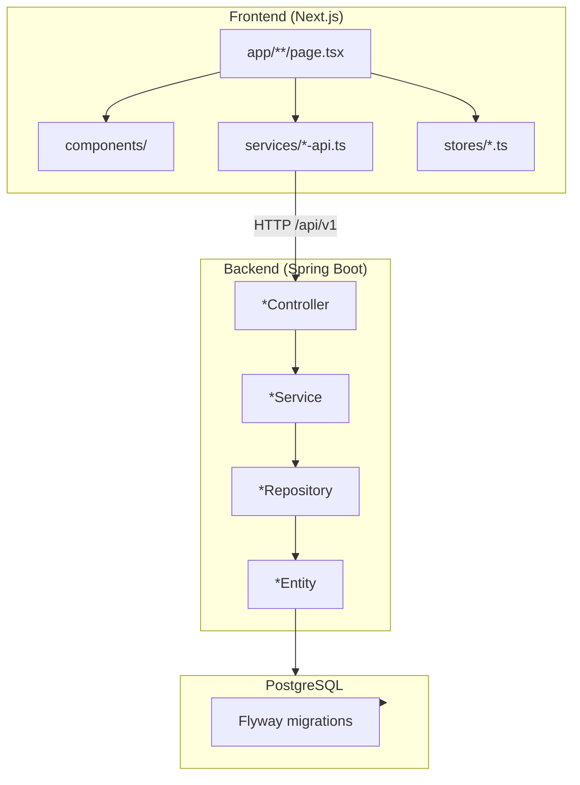
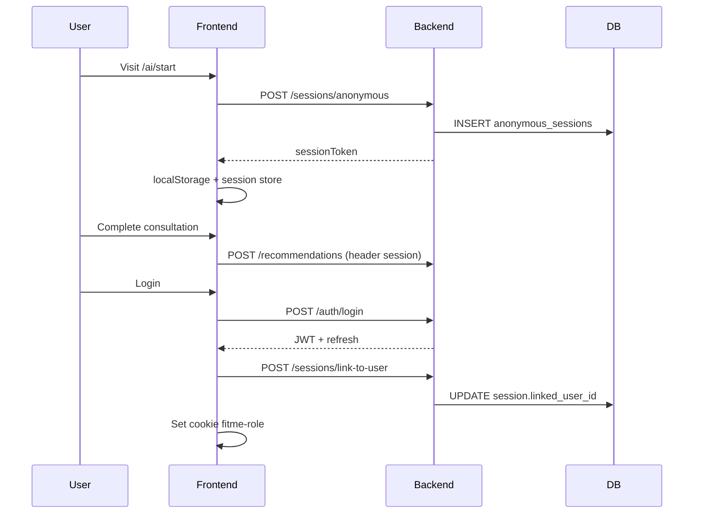

# FitMe AI — Hướng dẫn phát triển (Developer Guide)

Tài liệu onboarding cho **developer mới** — giải thích kiến trúc, cấu trúc code, luồng dữ liệu, quy ước và cách mở rộng hệ thống an toàn.

> Đọc kèm: [ARCHITECTURE.md](ARCHITECTURE.md) (tóm tắt), [API_CONTRACT.md](API_CONTRACT.md) (endpoint map), [USER_GUIDE.md](USER_GUIDE.md) (demo theo role).

---

## 1. Tổng quan hệ thống

### 1.1 Mục tiêu sản phẩm

FitMe AI là web app thời trang cá nhân hóa bằng AI dành cho Gen Z theo mô hình B2C:

- Tư vấn và gợi ý outfit, size, form, màu sắc theo profile người dùng
- Thử đồ AI ảo bằng Fitken (1 Fitken = 1 lượt thử đồ AI; tặng 5 Fitken dùng thử cho tài khoản mới)
- Gói **FitMe Premium** (mặc định 49.000đ / 30 ngày, thanh toán PayOS): 15 Fitken/tháng, tủ đồ cá nhân, brand yêu thích, cá nhân hóa sâu
- Trần Fitken miễn phí (cài đặt `fitken.max_balance`, mặc định 50) cho Fitken từ trial và nhận thưởng
- Nhận thưởng Fitken miễn phí: điểm danh chuỗi 3 ngày (+1), chia sẻ bài đăng (+3), đánh giá có ảnh (+2)
- Thư viện ảnh outfit cá nhân (`/profile/gallery`)
- **FitMe không bán hàng**: nút "Mua tại cửa hàng gốc" chuyển khách sang `purchaseUrl` của brand (bắt buộc). User đồng ý `BRAND_LEAD_SHARING` thì brand nhận khách quan tâm (tên, email). Giỏ hàng / đơn / vận đơn / đối soát đã gỡ ở V27
- Portal brand miễn phí (catalog, dashboard, analytics); **Brand Plus** trả phí (mặc định 999.000đ / 30 ngày): huy hiệu Plus, lượt thử đồ miễn phí cho khách, ưu tiên gợi ý, chi tiết khách quan tâm; mua có thể kèm voucher brand
- Portal admin: tài khoản & Premium, duyệt brand / sản phẩm, gói dịch vụ (người dùng + brand), voucher brand, cài đặt hệ thống, retention, duyệt thưởng, kiểm duyệt review

### 1.2 Stack

| Layer | Tech | Thư mục |
|-------|------|---------|
| Frontend | Next.js 16 App Router, TS, Tailwind 4, TanStack Query, Zustand | `frontend/` |
| Backend | Java 21, Spring Boot 3.3, JPA, Flyway | `backend/` |
| Database | PostgreSQL 16 | Docker / Neon |
| Auth | JWT (access + refresh), anonymous session header | |
| Test | JUnit + Testcontainers, Vitest, Playwright | |
| CI | GitHub Actions | `.github/workflows/ci.yml` |

### 1.3 Luồng request

```
Browser
  → Next.js (:3000)
      rewrite /api/v1/* → Spring Boot (:8080)
  → PostgreSQL
```

File cấu hình proxy: `frontend/next.config.ts` — biến `BACKEND_INTERNAL_URL` (Docker/production).

---

## 2. Kiến trúc logic

### 2.1 Sơ đồ thành phần


```mermaid
flowchart TB
  subgraph FE["Frontend (Next.js)"]
    Pages["app/**/page.tsx"]
    Components["components/"]
    Services["services/*-api.ts"]
    Stores["stores/*.ts"]
    Pages --> Components
    Pages --> Services
    Pages --> Stores
  end

  subgraph BE["Backend (Spring Boot)"]
    Ctrl["*Controller"]
    Svc["*Service"]
    Repo["*Repository"]
    Entity["*Entity"]
    Ctrl --> Svc --> Repo --> Entity
  end

  subgraph DB["PostgreSQL"]
    Flyway["Flyway migrations"]
  end

  Services -->|HTTP /api/v1| Ctrl
  Entity --> DB
  Flyway --> DB
```

### 2.2 Domain modules (backend)

Package gốc: `com.fitme`

| Package | Trách nhiệm |
|---------|-------------|
| `fitken` | Quản lý ví Fitken, ledger, cấp trial credit, trần Fitken miễn phí |
| `billing` | BillingPlan (`audience` CONSUMER / BRAND, giảm giá theo thời gian), gói Premium, đơn PayOS, PayOS webhook, `BillingOrderExpiryJob` |
| `entitlement` | Phân tầng FitMe Free vs FitMe Premium (coherence modes, `requirePremium` → `PREMIUM_REQUIRED`) |
| `preference` | Brand yêu thích của user Premium (`DIVERSE` / `FAVORITES_ONLY`, tối đa 10 brand) |
| `brandplus` | Gói Brand Plus: trạng thái, báo giá, checkout, kích hoạt / gia hạn, job hết hạn |
| `brandvoucher` | Chiến dịch voucher, phát / thu hồi, giữ / trả voucher theo đơn Plus, job hết hạn |
| `brandlead` | Khách quan tâm từ buy-click có consent, đánh dấu đã bán (`PLUS_REQUIRED`) |
| `settings` | Cài đặt hệ thống (`system_settings`), cache 60 giây |
| `rewards` | Điểm danh nhận thưởng chuỗi 3 ngày, gửi duyệt bài đăng chia sẻ |
| `review` | Đánh giá sản phẩm có ảnh, nhãn "Đã mua hàng" (tự xác nhận mua hoặc lead brand Plus đã bán) |
| `gallery` | Thư viện ảnh outfit cá nhân (`outfit_gallery_images`) |
| `session` | Anonymous session, link-to-user |
| `auth` | Register, login, refresh, reset password, email verification |
| `userprofile` | Body/style profile (`/me`) |
| `wardrobe` | Tủ đồ cá nhân (Premium) |
| `product` | Catalog public + brand CRUD (`purchaseUrl` bắt buộc) + admin moderation |
| `brand` | Brand entity, application, dashboard brand miễn phí |
| `recommendation` | Pipeline gợi ý outfit AI (rule + Gemini hybrid), ưu tiên brand Plus |
| `stylistchat` | Tư vấn stylist qua chat AI |
| `tryon` | Try-on request lifecycle (1 Fitken/lượt AI hoặc lượt Plus miễn phí) |
| `preview` | Photo upload + preview generation (FASHN / IDM-VTON) |
| `redirect` | Buy-click, chuyển sang cửa hàng gốc, lịch sử mua, tự xác nhận đã mua, tạo lead |
| `feedback` | User feedback on recommendations |
| `privacy` | Consent (kể cả `BRAND_LEAD_SHARING`), deletion requests |
| `analytics` | Dashboard brand / admin, tăng trưởng, retention, khách trả tiền, truy cập |
| `admin` | Rules, flagged links, privacy admin, monitoring, quản lý tài khoản, avatar thử đồ |
| `storage` | Local file storage (`./uploads`) / Cloudflare R2 |
| `common` | Security, config (FitMeProperties), enums, exceptions, seed |

Đã gỡ ở V27: `cart`, `address`, `order`, `settlement`, `logistics`, `voucher` (voucher freeship người dùng).

### 2.3 Controllers map

| Controller | Prefix | Role guard |
|------------|--------|------------|
| `FitkenController` | `/api/v1/me/fitken` | User auth |
| `ConsumerSubscriptionController` | `/api/v1/me/subscription` | User auth |
| `PlanController` | `/api/v1/plans` | Public |
| `RewardController` | `/api/v1/rewards` | User auth |
| `ReviewController` | `/api/v1/products/{id}/reviews`, `/api/v1/reviews` | Public / User auth |
| `GalleryController` | `/api/v1/me/gallery` | User auth |
| `BrandPreferenceController` | `/api/v1/me/brand-preferences` | User auth (PUT cần Premium) |
| `BrandPlusController` | `/api/v1/brand/plan` | `BRAND_OWNER` |
| `BrandVoucherController` | `/api/v1/brand/vouchers` | `BRAND_OWNER` |
| `BrandLeadController` | `/api/v1/brand/leads` | `BRAND_OWNER` (chi tiết / đánh dấu đã bán cần Plus) |
| `AdminUserController` | `/api/v1/admin/users` | `ADMIN` |
| `AdminFitkenController` | `/api/v1/admin/consumers/{userId}/fitken` | `ADMIN` |
| `AdminRewardController` | `/api/v1/admin/rewards` | `ADMIN` |
| `AdminReviewController` | `/api/v1/admin/reviews` | `ADMIN` |
| `AdminGalleryController` | `/api/v1/admin/gallery` | `ADMIN` |
| `AdminBillingController` | `/api/v1/admin/billing` | `ADMIN` |
| `AdminBrandPlusController` | `/api/v1/admin/brand-subscriptions` | `ADMIN` |
| `AdminVoucherCampaignController` | `/api/v1/admin/voucher-campaigns`, `/api/v1/admin/brand-vouchers` | `ADMIN` |
| `AdminSystemSettingsController` | `/api/v1/admin/settings` | `ADMIN` |
| `AdminTryOnAvatarController` | `/api/v1/admin/tryon-avatars` | `ADMIN` |
| `PayOsWebhookController` | `/api/v1/webhooks/payos` | Public / PayOS (đơn Premium và Brand Plus) |
| `ConsumerEntitlementController` | `/api/v1/me/entitlement` | Public / Admin |
| `SessionController` | `/api/v1/sessions` | Public |
| `AuthController` | `/api/v1/auth` | Public |
| `ProfileController` | `/api/v1/me` | Session or auth (filter) |
| `WardrobeController` | `/api/v1/wardrobe` | User Premium (`PREMIUM_REQUIRED`) |
| `ProductController` | `/api/v1/products` | GET public |
| `BrandPublicController` | `/api/v1/brands` | GET public |
| `RecommendationController` | `/api/v1/recommendations` | Mostly public/session |
| `StylistChatController` | `/api/v1/stylist` | Public / Session |
| `TryOnController` | `/api/v1/try-on/requests` | Session |
| `PhotoUploadController` | `/api/v1/uploads` | Session |
| `PreviewController` | `/api/v1/previews` | Session |
| `RedirectController` | `/api/v1/redirects` | Public |
| `PrivacyController` | `/api/v1/privacy` | Auth |
| `BrandProductController` | `/api/v1/brand/products` | `BRAND_OWNER` |
| `BrandDashboardController` | `/api/v1/brand` | `BRAND_OWNER` |
| `BrandApplicationController` | `/api/v1/brand/applications` | Authenticated USER |
| `AdminController` | `/api/v1/admin` | `ADMIN` |
| `AdminProductController` | `/api/v1/admin/products` | `ADMIN` |
| `TestAuthController` | `/api/v1/test` | Test-only helpers |

Chi tiết field JSON: Swagger `http://localhost:8080/swagger-ui.html` hoặc [API_CONTRACT.md](API_CONTRACT.md).

---

## 3. Frontend — cấu trúc & quy ước

### 3.1 Thư mục quan trọng

```
frontend/src/
├── app/                    # App Router — 1 folder = 1 route
│   ├── page.tsx            # Marketing home (layout riêng)
│   ├── ai/                 # Wizard tư vấn AI
│   ├── try-on/             # Virtual try-on (tiêu Fitken)
│   ├── pricing/            # Bảng giá FitMe Free vs FitMe Premium
│   ├── billing/return/     # Trả về sau PayOS gói Premium
│   ├── rewards/            # Trang Nhận thưởng (điểm danh, chia sẻ, đánh giá)
│   ├── redirect/           # Xác nhận mua tại cửa hàng gốc (consent chia sẻ thông tin) → loading
│   ├── wardrobe/           # Tủ đồ cá nhân (Premium)
│   ├── discover/           # Catalog + search
│   ├── auth/               # Login/register/reset
│   ├── brand/              # Brand portal (catalog, leads, plan/Gói Plus, analytics)
│   ├── admin/              # Admin portal (users, billing/plans, vouchers, settings, retention, rewards, reviews)
│   ├── profile/            # User profile, gallery, purchases, style-preferences
│   └── api/auth/session/   # Route handler set cookie role
├── components/
│   ├── ui/                 # Radix + shadcn-style primitives
│   ├── layout/             # Shells (PageShell, Header, FlowStepper…)
│   ├── common/             # ProductCard, EmptyState…
│   ├── brand/ product/ tryon/
├── services/               # Axios clients → /api/v1
├── stores/                 # Zustand global state
├── hooks/                  # use-ensure-session, use-auth-redirect…
├── types/                  # Domain TS types
├── lib/design-tokens.ts    # Class constants
└── middleware.ts           # RBAC route guard (brand/admin)
```

### 3.2 Layout system

| Ngữ cảnh | Component | Ghi chú |
|----------|-----------|---------|
| Consumer pages | `PageShell` + `PageHeader` | Props `width`: narrow/medium/wide |
| **Mobile consumer** | `ConsumerChrome` + `MobileBottomNav` | Bottom nav `< md`; logic trong `lib/mobile-chrome.ts` |
| Sticky filter (discover) | `StickyToolbar` | Inline Tailwind, `top-16` dưới header |
| Auth pages | `AuthCardShell` | Card centered max-w-md |
| Brand/Admin | `PortalLayout` | Sidebar + content |
| AI/Try-on wizard | `FlowStepper` | Read-only progress |
| Try-on variants | `TryOnVariantShell` | Size/form/color/decision |

**Quy tắc quan trọng:** Khi restyle UI, **không đổi** text `h1`, label button, `id`/`label` form field — E2E Playwright dựa vào accessible name.

#### Mobile consumer chrome

- [`ConsumerChrome.tsx`](frontend/src/components/layout/ConsumerChrome.tsx) — bọc Header, main (`pb-mobile-nav`), Footer, `MobileBottomNav`
- [`mobile-chrome.ts`](frontend/src/lib/mobile-chrome.ts) — `shouldShowBottomNav()`, `isCompactHeader()`, `getActiveMobileNavTab()`
- Bottom nav **ẩn** trên auth, portal, redirect, wizard AI/try-on (xem danh sách trong file)
- Header mobile compact: logo + quick search (không hamburger khi bottom nav hiện)
- CSS: `.pb-mobile-nav`, `--mobile-nav-height`, `env(safe-area-inset-bottom)` trong [`globals.css`](frontend/src/app/globals.css)
- E2E mobile: `e2e/mobile-nav.spec.ts` — project Playwright `mobile-chrome` (iPhone 13)

**Khi thêm trang consumer mới:** cập nhật `shouldShowBottomNav` nếu trang cần ẩn/hiện bottom nav; đảm bảo CTA cuối trang không bị nav che (`pb-mobile-nav` trên main hoặc section cuối).

### 3.3 State management

| Store | File | Nội dung |
|-------|------|----------|
| Auth | `stores/auth-store.ts` | accessToken, refreshToken, user |
| Session | `stores/session-store.ts` | anonymous session token |
| Consultation | `stores/consultation-store.ts` | Wizard draft (body/style/occasion) |
| Try-on | `stores/tryon-store.ts` | Selected products, measurements |

Hydration SSR: `components/StoreHydration.tsx` — rehydrate Zustand sau mount.

### 3.4 API client

`services/api-client.ts`:

- Base URL: `/api/v1` (relative — qua Next rewrite)
- Tự gắn `Authorization: Bearer …` từ auth store
- Tự gắn `X-Anonymous-Session` từ session store
- Interceptor refresh token khi 401

Mỗi domain có file riêng: `auth-api.ts`, `product-api.ts`, `recommendation-api.ts`, …

### 3.5 Routing & RBAC (frontend)

`middleware.ts` — chỉ match `/brand/*`, `/admin/*`:

- Cookie `fitme-role` set sau login qua `app/api/auth/session/route.ts`
- Giá trị: `USER`, `BRAND`, `ADMIN` (map từ backend `UserRole`)
- Public paths: `/brand/login`, `/brand/onboarding`, `/brand/pending`, `/admin/login`

**Lưu ý:** Middleware là guard UX — backend vẫn enforce JWT role.

### 3.6 Data fetching

TanStack Query (`providers.tsx`) cho server state:

```tsx
const { data } = useQuery({
  queryKey: ["products", filters],
  queryFn: () => productApi.list(filters),
});
```

Wizard flows thường dùng Zustand + POST trực tiếp qua service.

---

## 4. Backend — cấu trúc & quy ước

### 4.1 Layer pattern

Mỗi domain tuân theo:

```
controller/   @RestController, validation, HTTP status
service/      business logic, @Transactional
repository/   Spring Data JPA
entity/       @Entity
dto/          Java records cho request/response
```

Response envelope thống nhất — `common/dto/ApiResponse.java`:

```json
{ "success": true, "data": { ... }, "error": null, "message": null }
```

Exception → `GlobalExceptionHandler` → HTTP 4xx/5xx + message.

### 4.2 Security pipeline

Filter chain (`SecurityConfig.java`):

1. `AnonymousSessionFilter` — đọc header `X-Anonymous-Session`
2. `JwtAuthenticationFilter` — parse Bearer JWT
3. `SessionOrAuthFilter` — gắn request context (userId hoặc sessionId)

Role mapping Spring Security:

- Backend enum `UserRole.BRAND_OWNER` → authority `ROLE_BRAND_OWNER`
- `@PreAuthorize` / `hasRole("ADMIN")` trên admin endpoints

`OwnershipChecker` — verify brand owner chỉ sửa SP của mình.

### 4.3 Recommendation pipeline (đã tách service)

```
RecommendationController
  └── RecommendationService (orchestrator)
        ├── WardrobeBlendService      # Blend wardrobe items vào outfit
        ├── OutfitScoringService      # Score candidate products
        ├── OutfitCompositionService  # Compose final outfit
        ├── SizeResolutionService     # Map body → size chart
        └── RecommendationMapper      # Entity → DTO
```

Khi sửa logic gợi ý: ưu tiên sửa service con, giữ orchestrator mỏng.

### 4.4 Admin surface (đã tách)

```
AdminController
  ├── AdminRuleService
  ├── AdminFlaggedLinkService
  ├── AdminPreviewMonitoringService
  ├── BrandService (approve brand)
  └── PrivacyService (admin view)

AdminProductController → ProductService.moderate()
```

Admin DTOs tách riêng (`StyleRuleDto`, `ConsentRecordDto`, …) — không expose entity trực tiếp.

### 4.5 Database & migrations

- Flyway: `backend/src/main/resources/db/migration/`
- `V1__init_schema.sql` — ~24 bảng (users, sessions, profiles, brands, products, recommendations, try_on, redirects, rules…)
- `V2__auth_tokens.sql` — refresh token revocations
- `V27__remove_commerce.sql` — gỡ giỏ hàng, đơn, địa chỉ, vận đơn, đối soát, voucher người dùng, tồn kho biến thể
- `V28` → `V32` — cài đặt hệ thống & Premium & brand yêu thích, Brand Plus, lượt thử Plus miễn phí, voucher brand, khách quan tâm (chi tiết: [ARCHITECTURE.md](ARCHITECTURE.md#database))
- Hiện có 31 file, mới nhất `V32`, không có `V5`
- Hibernate `ddl-auto: validate` — **không** auto DDL

**Quy tắc migration:**

- Không sửa file migration đã chạy trên production — tạo file mới tiếp theo (`V33__...sql`)
- Local dev DB cũ: drop DB hoặc `flyway repair` nếu checksum lệch

### 4.6 Seed data

`common/config/SeedDataLoader.java` — `@Profile("!test")`:

- Chạy khi `fitme.seed.enabled=true` và `user_accounts` trống
- Tạo admin, brand owner, user demo + brand + products ACTIVE
- Config qua env: `FITME_SEED_*`, `FITME_SEED_PASSWORD`

---

## 5. Luồng dữ liệu quan trọng

### 5.1 Anonymous session → login


```mermaid
sequenceDiagram
  participant U as User
  participant FE as Frontend
  participant BE as Backend
  participant DB as DB

  U->>FE: Visit /ai/start
  FE->>BE: POST /sessions/anonymous
  BE->>DB: INSERT anonymous_sessions
  BE-->>FE: sessionToken
  FE->>FE: localStorage + session store

  U->>FE: Complete consultation
  FE->>BE: POST /recommendations (header session)

  U->>FE: Login
  FE->>BE: POST /auth/login
  BE-->>FE: JWT + refresh
  FE->>BE: POST /sessions/link-to-user
  BE->>DB: UPDATE session.linked_user_id
  FE->>FE: Set cookie fitme-role
```

### 5.2 Mua tại cửa hàng gốc & khách quan tâm

1. PDP "Mua tại cửa hàng gốc" → `/redirect/confirm/{productId}`; user đăng nhập bật / tắt ô chia sẻ thông tin (`POST /privacy/consent` với `BRAND_LEAD_SHARING`)
2. FE `POST /redirects/buy-click` — track click + metadata, BE trả `eventId` + `redirectUrl` (= `purchaseUrl` của sản phẩm)
3. Nếu user đang đồng ý `BRAND_LEAD_SHARING`: tạo `brand_leads` (tối đa 1 / user / sản phẩm / ngày)
4. `/redirect/loading` lấy URL từ sự kiện (`GET /redirects/{eventId}`, bỏ qua `?url=` để chống open redirect) → mở URL brand
5. User có thể tự xác nhận đã mua ở `/profile/purchases`; brand Plus đánh dấu lead đã bán → nhãn "Đã mua hàng" trên review

### 5.3 Brand product lifecycle

```
BrandProductController.create()     → DRAFT
BrandProductController.submit()     → PENDING_REVIEW
AdminProductController.approve()    → ACTIVE (visible on /discover)
AdminProductController.flag()       → FLAGGED
```

`ProductEligibilityService` — filter catalog public (ACTIVE, không `OUT_OF_STOCK`, có ảnh…). Brand không tạo / sửa được sản phẩm thiếu `purchaseUrl` hợp lệ (`INVALID_PURCHASE_URL`), admin không duyệt được sản phẩm thiếu link.

AI try-on chỉ dùng ảnh `TRY_ON` brand chọn trong gallery (không fallback về ảnh chính). `TryOnService.generate` từ chối phiên còn món bị ẩn / mất điều kiện / mất ảnh `TRY_ON` (`TRY_ON_ITEM_UNAVAILABLE`) trước khi trừ Fitken.

### 5.3b Catalog thật & ảnh

`seed/fashion-catalog.json` (7 brand Shopee, 70 SP) được đồng bộ khi khởi động bởi `SeedDataLoader` → `CatalogBrandSync` (brand) + `FashionCatalogSeeder` (sản phẩm):

- **Khóa ổn định, không theo tên/vị trí:** brand khớp theo `brands.catalog_key` (= `key` trong catalog), sản phẩm khớp theo `products.catalog_item_id` (= `itemId`, mã item Shopee). `retiredBrands` là danh sách `catalog_key`; brand đó bị tạm ngưng, bỏ chủ, ẩn sản phẩm, kết thúc partnership. Migration V35 gán key cho 7 brand thật + 5 brand demo cũ theo tên một lần; DB cũ chưa có item id được nối theo thứ tạo một lần (ưu tiên sản phẩm đang hiển thị).
- **Không ghi đè chỉnh sửa:** brand/sản phẩm chỉ được catalog cập nhật khi còn `catalog_managed = true` **và** hash mục catalog (`catalog_hash`) thay đổi. Brand sửa hồ sơ / logo hoặc sửa sản phẩm trong portal → `catalog_managed = false`, catalog không đụng nữa. Đồng bộ không bao giờ đổi trạng thái sản phẩm (sản phẩm bị ẩn / từ chối / gắn cờ giữ nguyên) và chỉ đặt brand `APPROVED` khi tạo mới (admin tạm ngưng thì giữ nguyên). Sản phẩm catalog bị bỏ khỏi file → ẩn.
- **Tài khoản chủ brand** (`ownerEmail`) được tạo với mật khẩu ngẫu nhiên không dùng được (BCrypt của 32 byte `SecureRandom`, không lưu/log); tài khoản đã tồn tại không bao giờ bị đổi mật khẩu. Admin bàn giao qua `PATCH /admin/users/{id}/credentials` (UI: Quản trị → Tài khoản → Đăng nhập). Dev/CI có thể bật `FITME_SEED_CATALOG_OWNER_LOGIN=true` để dùng `FITME_SEED_PASSWORD` (bị bỏ qua dưới profile `prod`).
- **Một ảnh `TRY_ON` / sản phẩm:** partial unique index `uq_product_images_one_try_on`; giày/phụ kiện không có ảnh `TRY_ON`. Code xóa rồi chèn lại ảnh phải `flush()` sau khi xóa (Hibernate chèn trước, xóa sau).
- Tên brand duy nhất không phân biệt hoa thường (`BRAND_NAME_TAKEN`); index `uq_brands_lower_name` chỉ được tạo khi dữ liệu cũ không trùng.

`CatalogMediaMirrorRunner` chạy nền sau `ApplicationReadyEvent`: `CatalogMediaService` tải từng ảnh nguồn chưa có trong bảng `catalog_media_mirror` (timeout 10s/30s, 4 luồng), lưu qua `StorageService` vào `catalog-media/<mã ảnh Shopee>.jpg` (R2 trên prod, ổ đĩa local khi dev) rồi đổi `product_images.image_url` / `brands.logo_url` sang bản sao. URL lưu là URL public R2 nếu kiểm tra truy cập được, nếu không là `/uploads/catalog-media/...` (backend phục vụ). Ảnh tải lỗi giữ URL nguồn và được thử lại ở lần khởi động sau. Tắt bằng `FITME_CATALOG_MIRROR_ENABLED=false` (CI E2E).

### 5.4 Brand application

```
POST /brand/applications     (USER authenticated)
Admin approve brand          → user.role = BRAND_OWNER, brand.status = APPROVED
User re-login                → JWT mới có role BRAND_OWNER
```

---

## 6. Cấu hình môi trường

### 6.1 Backend (`application.yml` + env)

| Biến | Mặc định | Mô tả |
|------|----------|-------|
| `DB_URL` | `jdbc:postgresql://localhost:5432/fitme` | Postgres JDBC |
| `DB_USERNAME` / `DB_PASSWORD` | xem `.env.example` | Không ghi giá trị vào tài liệu |
| `JWT_SECRET` | dev placeholder | **Bắt buộc đổi production** |
| `CORS_ORIGINS` | `http://localhost:3000` | Comma-separated |
| `FITME_SEED_ENABLED` | true | Tắt trên prod thật |
| `FITME_SEED_PASSWORD` | không có (đặt trong `.env.local` khi dev) | Mật khẩu tài khoản seed (`user@`, `premium@`, `brand@`, `admin@fitme.ai`) khi seed DB trống; để trống → mật khẩu ngẫu nhiên. Không bao giờ ghi giá trị vào file commit |
| `FITME_SEED_CATALOG_OWNER_LOGIN` | false | Dev/CI: tài khoản brand thật (`teelab@`…) mới tạo cũng dùng `FITME_SEED_PASSWORD`. Bị bỏ qua dưới profile `prod` |
| `AI_VTON_INTERNAL_TOKEN` | trống | Bí mật chung gửi kèm header `X-Internal-Token` tới ai-vton (phải trùng `VTON_INTERNAL_TOKEN` của ai-vton) |
| `FITME_TEST_EXPOSE_RESET_TOKENS` | false | Bật cho E2E reset-password |
| `UPLOAD_DIR` | `./uploads` | Local photo storage |
| `PAYOS_MOCK` | true | `true` = link thanh toán giả lập (mở là PAID). Dưới profile `prod`, backend **từ chối khởi động** nếu `PAYOS_MOCK=true` hoặc thiếu `PAYOS_CHECKSUM_KEY` (`PayOsProductionGuard`) |
| `PAYOS_CLIENT_ID` / `PAYOS_API_KEY` / `PAYOS_CHECKSUM_KEY` | trống | Khoá PayOS (chỉ đặt qua env / secret store) |
| `PAYOS_SUBSCRIPTION_RETURN_URL` / `PAYOS_SUBSCRIPTION_CANCEL_URL` | `http://localhost:3000/billing/return?status=…` | Trang trả về gói Premium |
| `PAYOS_BRAND_PLUS_RETURN_URL` / `PAYOS_BRAND_PLUS_CANCEL_URL` | trống | Trang trả về Gói Plus; trống = `/brand/plan/return?status=…` trên origin của `PAYOS_SUBSCRIPTION_RETURN_URL` |
| `FITME_CONSUMER_ENTITLEMENT_ENABLED` | true | Bật phân tầng Free / Premium |
| `FITME_FREE_COHERENCE_MODE` / `FITME_PREMIUM_COHERENCE_MODE` | OFF / PREFER | Coherence mode theo gói (`FITME_PLUS_COHERENCE_MODE` cũ vẫn được đọc làm fallback) |
| `FITME_FREE_PREFERENCE_SCALE` / `FITME_PREMIUM_PREFERENCE_SCALE` | 1.0 / 1.75 | Trọng số sở thích theo gói (`FITME_PLUS_PREFERENCE_SCALE` cũ là fallback) |
| `FITME_FITKEN_*` | xem `application.yml` | Trial (5), thưởng điểm danh / chia sẻ / đánh giá, giá 1 lượt thử |
| `fitme.billing.pending-expiry-hours` | 24 | Property (không có trong `application.yml`): đơn gói `PENDING` quá số giờ này bị `EXPIRED` |

Đã bỏ cùng thương mại (V27): `PAYOS_ORDER_*`, `FITME_COMMERCE_*`, `FITME_LOGISTICS_WEBHOOK_TOKEN`.

Cài đặt runtime (trần Fitken, lượt thử Plus miễn phí, điểm ưu tiên Plus) **không** dùng env — admin chỉnh tại `/admin/settings` (bảng `system_settings`).

### 6.2 Frontend

| Biến | Mô tả |
|------|-------|
| `BACKEND_INTERNAL_URL` | URL backend cho rewrite (Docker: `http://backend:8080`) |
| `NEXT_PUBLIC_API_URL` | Build-time (thường `/api/v1`) |

File mẫu: `.env.example`, `.env.test.example`, `.env.cloud.example`

---

## 7. Testing — hướng dẫn dev

### 7.1 Kim tự tháp test

```
     E2E Playwright (22 spec: 127 chromium + 5 mobile-chrome)
       /                    \
  FE Vitest (273 / 64 file)   BE JUnit (389 / 94 class)
```

Số liệu ở commit `bc323e2` (BE / FE đếm trong code). Test case theo module: [TEST_CASES.md](TEST_CASES.md).

### 7.2 Backend

```bash
cd backend
mvn test
```

- Testcontainers PostgreSQL — cần Docker
- MockMvc integration tests per controller
- Service unit tests (recommendation sub-services)

### 7.3 Frontend unit

```bash
cd frontend
npm test
```

Vitest + Testing Library — stores, API mappers, layout components.

**OneDrive path issue:** copy repo sang `%TEMP%` nếu Vitest fail trên OneDrive sync folder.

### 7.4 E2E

Yêu cầu: FE `:3000` + BE `:8080` đang chạy.

```bash
cd frontend
npm run test:e2e              # full suite (desktop; mobile-nav via project mobile-chrome)
npx playwright test e2e/mobile-nav.spec.ts --project=mobile-chrome
npm run test:e2e:roles        # role-flows only, serial
```

Helpers: `frontend/e2e/helpers/` — `auth.ts`, `consultation.ts`, `brand.ts`, `roles.ts`, `portal.ts`

**Khi thêm màn hình mới:**

1. Thêm route + heading `h1` ổn định
2. Thêm entry vào `smoke-routes.spec.ts` hoặc `role-flows.spec.ts`
3. Chạy `.\scripts\test-flows.ps1`

### 7.5 CI

`.github/workflows/ci.yml`:

1. `mvn test`
2. `npm test` + `npm run build`
3. E2E "E2E (full suite)": Postgres service + spring-boot:run + Playwright, mọi spec trên chromium (1 worker, retry 2) và `mobile-nav` trên mobile-chrome

Local mirror: `bash scripts/ci-e2e.sh`

---

## 8. Quy trình phát triển feature mới

### 8.1 Checklist backend

1. Entity + migration Flyway (nếu schema mới)
2. Repository → Service → DTO → Controller
3. Cập nhật `SecurityConfig` nếu endpoint mới
4. Test: `*ControllerTest` + service test nếu logic phức tạp
5. Cập nhật Swagger / `API_CONTRACT.md`

### 8.2 Checklist frontend

1. Type trong `types/`
2. Service method trong `services/*-api.ts`
3. Page trong `app/` — dùng layout shell phù hợp
4. TanStack Query key convention: `["domain", id, filters]`
5. E2E smoke nếu user-facing
6. Vitest nếu mapper/store logic

### 8.3 Thêm trang portal

1. Tạo `app/brand/.../page.tsx` hoặc `app/admin/.../page.tsx`
2. Wrap `PortalLayout`
3. Thêm sidebar link trong `lib/portal-nav.ts` (`brandNav` / `adminNav`)
4. Thêm vào `BRAND_PAGES` / `ADMIN_PAGES` trong `e2e/helpers/portal.ts`

### 8.4 Sửa UI an toàn

- ✅ Đổi màu, spacing, layout wrapper
- ✅ Thêm component mới không đổi contract API
- ❌ Đổi text button/heading mà E2E assert
- ❌ Đổi JSON field name không sync BE

---

## 9. Deploy

| Môi trường | Doc |
|------------|-----|
| Docker local | `docker-compose.yml`, README |
| Staging test | [DEPLOY_TEST.md](DEPLOY_TEST.md), `scripts/deploy-test.ps1` |
| Free cloud | [DEPLOY_VERCEL_RENDER_NEON.md](DEPLOY_VERCEL_RENDER_NEON.md) |

Frontend Docker: `output: "standalone"` trong `next.config.ts`  
Backend Docker: `backend/Dockerfile` — multi-stage Maven build

---

## 10. Troubleshooting phổ biến

| Triệu chứng | Nguyên nhân | Cách xử lý |
|-------------|-------------|------------|
| Flyway checksum mismatch | Sửa migration cũ | Drop DB dev hoặc tạo migration mới |
| 403 trên `/api/v1/brand/**` | JWT thiếu role | Re-login sau admin duyệt brand |
| Discover trống | Không có SP ACTIVE | Admin duyệt hoặc bật seed |
| E2E flaky navigation | Parallel + hydration | Dùng `--workers=1`, wait heading visible |
| CORS error | Origin không whitelist | Set `CORS_ORIGINS` |
| Upload fail | File > 5MB | Giảm size hoặc tăng `spring.servlet.multipart` |

---

## 11. Tài liệu & file tham chiếu

| File | Nội dung |
|------|----------|
| [USER_GUIDE.md](USER_GUIDE.md) | Hướng dẫn 3 role + test manual/auto |
| [ARCHITECTURE.md](ARCHITECTURE.md) | Overview ngắn |
| [API_CONTRACT.md](API_CONTRACT.md) | FE service ↔ BE controller |
| [QA_REPORT.md](QA_REPORT.md) | Kết quả QA regression |
| `FitMe_AI_FRONTEND_DEVELOPMENT_GUIDE.md` | Guide FE chi tiết (legacy) |
| `FitMe_AI_BACKEND_DEVELOPMENT_GUIDE.md` | Guide BE chi tiết (legacy) |
| `scripts/test-flows.ps1` | Runner test theo luồng |
| `frontend/e2e/role-flows.spec.ts` | Spec E2E 3-role canonical |

---

## 12. Glossary

| Thuật ngữ | Ý nghĩa |
|-----------|---------|
| Session ẩn danh | UUID token, không cần login, TTL có hạn |
| Link-to-user | Gắn session cũ vào user sau login |
| WardrobeMode | `NONE` / `BLEND` / `PRIORITY` — cách dùng tủ đồ trong gợi ý |
| Preview | Minh họa 2D outfit trên ảnh user |
| Try-on request | Entity lifecycle thử mặc (items → generate → result) |
| Flagged link | URL mua bị user báo lỗi / admin review |
| StyleRule / OccasionRule | Rule admin cấu hình cho scoring AI |

---

*Cập nhật: 2026-10-07 — đồng bộ với gỡ thương mại (V27) và Brand Plus / Premium / voucher brand / khách quan tâm (V28–V32, commit `bc323e2`).*
