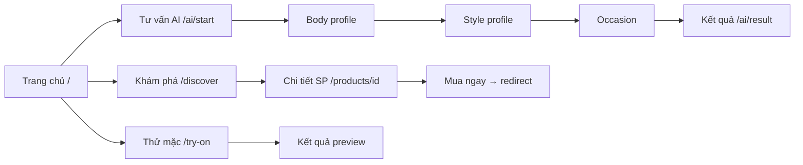
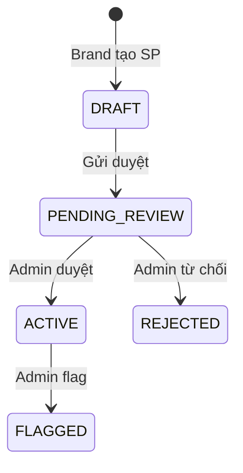

# FitMe AI — Hướng dẫn sử dụng theo vai trò

Tài liệu này dành cho **người dùng cuối, QA, demo và vận hành** — mô tả cách truy cập app (kể cả bản deploy) và sử dụng theo 3 vai trò.

> **Lưu ý MVP:** FitMe AI không xử lý thanh toán hay giao hàng. Preview AI chỉ mang tính minh họa tham khảo.

---

## 1. Truy cập app — đường dẫn deploy

Trong tài liệu này, **`{BASE_URL}`** = URL gốc mà admin/team cung cấp (trang chủ FitMe AI). Mọi đường dẫn khác **ghép sau** `{BASE_URL}`.

Ví dụ: nếu `{BASE_URL}` = `https://fitme-ai-mvp.vercel.app` thì trang Khám phá là  
`https://fitme-ai-mvp.vercel.app/discover`.

### 1.1 Ba môi trường thường gặp

| Môi trường | `{BASE_URL}` mẫu | Ai dùng | Ghi chú |
|------------|------------------|---------|---------|
| **Cloud (Vercel)** | `https://<tên-project>.vercel.app` | Demo public, tester bên ngoài | HTTPS; backend Render có thể **ngủ** — lần mở đầu chờ 30–60 giây |
| **Staging / VPS (Docker test)** | `http://<IP-server>:3000` | QA nội bộ, UAT trên LAN | HTTP; admin cấp IP + port |
| **Local (máy dev)** | `http://localhost:3000` | Dev, test trên máy cá nhân | Chỉ truy cập được trên máy đang chạy app |

**Người dùng thông thường chỉ cần mở `{BASE_URL}` trên trình duyệt** (Chrome, Safari, Edge). Không cần cài app, không cần mở port backend `:8080`.

Hướng dẫn deploy (dành admin): [DEPLOY_VERCEL_RENDER_NEON.md](DEPLOY_VERCEL_RENDER_NEON.md) · [DEPLOY_TEST.md](DEPLOY_TEST.md)

### 1.2 Bảng đường dẫn chính (3 vai trò)

Thay `{BASE_URL}` bằng URL thực tế của bạn.

#### Người dùng (USER) — không cần đăng nhập

| Chức năng | Đường dẫn đầy đủ |
|-----------|------------------|
| Trang chủ | `{BASE_URL}/` |
| Khám phá sản phẩm | `{BASE_URL}/discover` |
| Tìm kiếm nhanh (focus ô search) | `{BASE_URL}/discover#discover-search` |
| Chi tiết sản phẩm | `{BASE_URL}/products/{id}` |
| Bắt đầu tư vấn AI | `{BASE_URL}/ai/start` |
| Thử mặc AI | `{BASE_URL}/try-on` |
| Tủ đồ (cần session/login để lưu) | `{BASE_URL}/wardrobe` |
| Outfit đã lưu | `{BASE_URL}/saved-outfits` |

#### Người dùng (USER) — cần đăng nhập

| Chức năng | Đường dẫn đầy đủ |
|-----------|------------------|
| Đăng ký | `{BASE_URL}/auth/register` |
| Đăng nhập | `{BASE_URL}/auth/login` |
| Hồ sơ | `{BASE_URL}/profile` |
| Quyền riêng tư | `{BASE_URL}/profile/privacy` |
| Quên mật khẩu | `{BASE_URL}/auth/forgot-password` |
| Đặt lại mật khẩu | `{BASE_URL}/auth/reset-password?token=...` |
| Đăng ký đối tác Brand | `{BASE_URL}/brand/onboarding` |
| Theo dõi đơn Brand | `{BASE_URL}/brand/pending` |

#### Brand Owner

| Chức năng | Đường dẫn đầy đủ |
|-----------|------------------|
| **Đăng nhập Brand Portal** | `{BASE_URL}/brand/login` |
| Tổng quan | `{BASE_URL}/brand/dashboard` |
| Quản lý sản phẩm | `{BASE_URL}/brand/products` |
| Thêm sản phẩm | `{BASE_URL}/brand/products/new` |
| Phân tích | `{BASE_URL}/brand/analytics` |
| Cài đặt thương hiệu | `{BASE_URL}/brand/settings` |

#### Admin

| Chức năng | Đường dẫn đầy đủ |
|-----------|------------------|
| **Đăng nhập Admin** | `{BASE_URL}/admin/login` |
| Tổng quan hệ thống | `{BASE_URL}/admin/dashboard` |
| Duyệt thương hiệu | `{BASE_URL}/admin/brands` |
| Duyệt sản phẩm | `{BASE_URL}/admin/products/moderation` |
| Link bị báo lỗi | `{BASE_URL}/admin/flagged-links` |
| Rule AI | `{BASE_URL}/admin/rules/styles` · `{BASE_URL}/admin/rules/occasions` |
| Quyền riêng tư | `{BASE_URL}/admin/privacy` |

### 1.3 Ví dụ cụ thể — bản deploy cloud

Sau khi team deploy lên Vercel + Render (xem [DEPLOY_VERCEL_RENDER_NEON.md](DEPLOY_VERCEL_RENDER_NEON.md)), URL thường có dạng:

| Thành phần | URL ví dụ |
|------------|-----------|
| **App cho user (mở link này)** | `https://fitme-ai-mvp.vercel.app` |
| Đăng nhập User | `https://fitme-ai-mvp.vercel.app/auth/login` |
| Brand Portal | `https://fitme-ai-mvp.vercel.app/brand/login` |
| Admin Portal | `https://fitme-ai-mvp.vercel.app/admin/login` |
| API (qua proxy, kiểm tra kỹ thuật) | `https://fitme-ai-mvp.vercel.app/api/v1/products` |

> URL Vercel thực tế phụ thuộc tên project khi deploy — hỏi admin hoặc xem dashboard Vercel. Ví dụ trên chỉ là mẫu.

### 1.4 Ví dụ cụ thể — staging trên VPS / LAN

Admin deploy bằng `docker-compose.test.yml` và mở firewall port **3000**:

| Thành phần | URL ví dụ |
|------------|-----------|
| **App cho user** | `http://203.0.113.10:3000` |
| Brand Portal | `http://203.0.113.10:3000/brand/login` |
| Admin Portal | `http://203.0.113.10:3000/admin/login` |

Biến `PUBLIC_APP_URL` trong `.env.test` **phải khớp** URL trên (scheme + IP + port) — nếu không, đăng nhập/API có thể lỗi CORS.

### 1.5 Kiểm tra app deploy đã sẵn sàng

1. Mở `{BASE_URL}` — thấy trang chủ *「Đúng size, hợp dáng, chuẩn màu — thử trước khi mua.」*
2. Mở `{BASE_URL}/discover` — có danh sách sản phẩm (cần seed hoặc admin đã duyệt SP)
3. (Tùy chọn) Mở `{BASE_URL}/api/v1/products` — JSON `"success": true`

**Cloud Render free:** nếu trang load chậm hoặc API lỗi lần đầu, đợi ~1 phút rồi refresh (backend đang wake up).

### 1.6 Tài khoản demo (seed)

Dùng trên mọi môi trường có bật seed (`FITME_SEED_ENABLED=true`, DB trống lần đầu):

| Email | Mật khẩu | Vai trò | Đăng nhập tại |
|-------|----------|---------|---------------|
| `user@fitme.ai` | `fitme123` | USER | `{BASE_URL}/auth/login` |
| `brand@fitme.ai` | `fitme123` | BRAND_OWNER | `{BASE_URL}/brand/login` |
| `admin@fitme.ai` | `fitme123` | ADMIN | `{BASE_URL}/admin/login` |

Mật khẩu có thể khác nếu admin đổi `FITME_SEED_PASSWORD` khi deploy.

### 1.7 Sử dụng trên điện thoại (mobile)

Trên màn hình **nhỏ hơn tablet** (< 768px), app người dùng có giao diện kiểu app mobile:

**Thanh điều hướng dưới (bottom nav)** — 5 tab cố định:

| Tab | Chức năng |
|-----|-----------|
| Trang chủ | Về `{BASE_URL}/` |
| Khám phá | `{BASE_URL}/discover` |
| **Tư vấn AI** (nút giữa nổi) | `{BASE_URL}/ai/start` |
| Thử mặc | `{BASE_URL}/try-on` |
| Hồ sơ | `{BASE_URL}/profile` (chưa login → trang đăng nhập) |

**Header gọn:** logo FitMe AI + icon tìm kiếm nhanh (không còn menu hamburger).

**Tủ đồ / Outfit đã lưu / Quyền riêng tư:** vào tab **Hồ sơ** → chọn card tương ứng.

**Khám phá trên mobile:** ô tìm kiếm full-width + nút **Bộ lọc** (thương hiệu, danh mục, chỉ SP thử AI).

**Khi bottom nav ẩn:** đang đăng nhập/đăng ký, wizard tư vấn AI (body/style/occasion…), form thử mặc chi tiết, trang redirect — để tập trung hoàn thành luồng.

**Brand / Admin portal:** vẫn dùng giao diện desktop; khuyến nghị mở trên máy tính hoặc tablet ngang.

---

## 2. Chuẩn bị local (dev / QA trên máy)

Phần này dành cho người **tự chạy app trên máy**, không phải bản deploy public.

### Chạy nhanh (Docker)

```bash
cp .env.example .env
docker compose up --build
```

`{BASE_URL}` = `http://localhost:3000`

| Dịch vụ | URL |
|---------|-----|
| Frontend | http://localhost:3000 |
| API (qua proxy FE) | http://localhost:3000/api/v1 |
| Backend trực tiếp | http://localhost:8080/api/v1 |
| Swagger | http://localhost:8080/swagger-ui.html |

### Chạy local (dev)

```bash
# Terminal 1 — Postgres
docker compose up postgres -d

# Terminal 2 — Backend
cd backend && mvn spring-boot:run

# Terminal 3 — Frontend
cd frontend && npm install && npm run dev
```

---

## 3. Vai trò USER (Người dùng)

### 3.1 Mục đích

Khám phá sản phẩm, nhận tư vấn AI (size/phối đồ/màu), thử mặc 2D, quản lý tủ đồ và outfit đã lưu — **có thể dùng ẩn danh** hoặc **đăng nhập** để đồng bộ dữ liệu.

### 3.2 Luồng chính (không cần đăng nhập)



#### A. Tư vấn outfit AI (ẩn danh)

1. Mở **`{BASE_URL}`** → **Bắt đầu tư vấn outfit**
2. Hoặc menu **Tư vấn AI** / đường dẫn `/ai/start`
3. Điền lần lượt:
   - `/ai/body-profile` — chiều cao, cân nặng, fit preference, tone da
   - `/ai/style-profile` — gu thời trang, mức rủi ro
   - `/ai/occasion` — hoàn cảnh (đi làm, cafe, sự kiện…)
4. Chờ xử lý tại `/ai/processing` → xem kết quả tại `/ai/result/{id}`
5. Từ kết quả có thể: **Lưu gợi ý**, xem variant, preview ảnh (nếu upload)

#### B. Khám phá & mua hàng (redirect)

1. Menu **Khám phá** → `/discover`
2. Lọc theo thương hiệu, danh mục, tìm kiếm (sản phẩm hoặc brand)
3. Icon kính lúp trên header → `/discover#discover-search`
4. Bấm **Xem** trên card → `/products/{id}`
5. **Mua ngay** → `/redirect/confirm/{id}` → **Tiếp tục đến nơi bán** → chuyển sang Shopee/TikTok/website brand

#### C. Thử mặc AI (2D preview)

1. Menu **Thử mặc AI** → `/try-on`
2. Chọn sản phẩm → **Tiếp tục thử outfit**
3. Nhập thông tin tại `/try-on/input` (số đo, size, occasion…)
4. Chờ `/try-on/processing` → xem `/try-on/result/{id}`

### 3.3 Luồng cần đăng nhập

| Hành động | Đường dẫn | Ghi chú |
|-----------|-----------|---------|
| Đăng ký | `/auth/register` | Có thể redirect sau đăng ký |
| Đăng nhập | `/auth/login` | JWT + cookie `fitme-role` |
| Hồ sơ | `/profile` | Body/style profile đã lưu |
| Quyền riêng tư | `/profile/privacy` | Consent, yêu cầu xóa dữ liệu |
| Tủ đồ | `/wardrobe` | Thêm/sửa item cá nhân |
| Outfit đã lưu | `/saved-outfits` | Sau khi bấm **Lưu gợi ý** |
| Quên mật khẩu | `/auth/forgot-password` | MVP: token hiện trên UI mock |
| Đặt lại mật khẩu | `/auth/reset-password?token=...` | Cần token từ email mock |

**Sau đăng nhập:** session ẩn danh được **link** sang tài khoản — dữ liệu tư vấn trước đó không mất.

### 3.4 Đăng ký làm đối tác Brand (từ USER)

1. Đăng ký USER tại `/auth/register`
2. Vào `/brand/onboarding` — điền tên brand, email, website, mô tả
3. Theo dõi trạng thái tại `/brand/pending` (PENDING)
4. Admin duyệt → **đăng xuất và đăng nhập lại** tại `/brand/login`
5. Vào portal brand `/brand/dashboard`

### 3.5 Checklist test USER

| # | Kịch bản | Cách chạy tự động |
|---|----------|-------------------|
| 1 | Tư vấn ẩn danh → có kết quả AI | `npx playwright test e2e/role-flows.spec.ts -g "tư vấn outfit ẩn danh"` |
| 2 | Try-on → preview kết quả | `-g "thử mặc AI"` |
| 3 | Discover → mua → redirect | `-g "khám phá"` |
| 4 | Login → profile → wardrobe → saved | `-g "đăng nhập → hồ sơ"` |
| 5 | Forgot password MVP | `-g "quên mật khẩu"` |
| 6 | Privacy → gửi yêu cầu xóa | `-g "quyền riêng tư"` |
| 7 | Tư vấn từ SP → lưu → saved list | `-g "tư vấn từ sản phẩm"` |
| 8 | Wardrobe → tư vấn ưu tiên tủ đồ | `-g "tủ đồ → thêm item"` |

**Chạy toàn bộ luồng USER + public:**

```powershell
cd frontend
npx playwright test e2e/role-flows.spec.ts --grep "Luồng công khai|Luồng USER" --workers=1
```

**Test thủ công nhanh:** đăng nhập `user@fitme.ai` / `fitme123` → `/discover` → chọn sản phẩm → **Tư vấn size & phối đồ bằng AI** → hoàn thành wizard → **Lưu gợi ý** → kiểm tra `/saved-outfits`.

---

## 4. Vai trò BRAND_OWNER (Đối tác thương hiệu)

### 4.1 Mục đích

Quản lý catalog sản phẩm, gửi duyệt, xem analytics tổng hợp (redirect, try-on, dropoff…) — **không** thấy dữ liệu cá nhân người dùng.

### 4.2 Truy cập portal

1. Mở **`{BASE_URL}/brand/login`**
2. Đăng nhập tài khoản brand đã được admin duyệt
3. Middleware FE chặn `/brand/*` nếu cookie `fitme-role` ≠ `BRAND`

### 4.3 Các màn hình portal

| Đường dẫn | Chức năng |
|-----------|-----------|
| `/brand/dashboard` | Tổng quan KPI |
| `/brand/products` | Danh sách sản phẩm |
| `/brand/products/new` | Tạo sản phẩm mới |
| `/brand/products/{id}/edit` | Sửa, **Gửi duyệt** |
| `/brand/products/{id}/analytics` | Analytics theo SP |
| `/brand/analytics` | Phân tích tổng |
| `/brand/analytics/redirect` | Click chuyển hướng mua |
| `/brand/analytics/dropoff` | Điểm rời bỏ funnel |
| `/brand/analytics/hesitation` | Hành vi do dự |
| `/brand/analytics/try-on` | Thử mặc AI |
| `/brand/settings` | Cài đặt thương hiệu |

### 4.4 Quy trình sản phẩm



**Lưu ý MVP:**

- Ảnh sản phẩm nhập bằng **URL** (một URL/dòng), không upload file lên cloud
- Sản phẩm **ACTIVE** mới hiện trên `/discover` cho USER
- Size chart nhập trong form brand (JSON hoặc theo UI form)

### 4.5 Checklist test BRAND

| # | Kịch bản | Lệnh Playwright |
|---|----------|-----------------|
| 1 | Smoke tất cả trang portal | `npx playwright test e2e/role-flows.spec.ts -g "Luồng BRAND"` |
| 2 | Tạo SP → gửi duyệt | `-g "tạo sản phẩm"` |
| 3 | CRUD đầy đủ | `npx playwright test e2e/brand-full.spec.ts` |
| 4 | Portal smoke | `npx playwright test e2e/brand-portal.spec.ts` |

**Test thủ công:** login `brand@fitme.ai` → **Thêm sản phẩm** → điền form → **Tạo** → **Sửa** → **Gửi duyệt** → thấy trạng thái `PENDING_REVIEW`.

---

## 5. Vai trò ADMIN

### 5.1 Mục đích

Vận hành nền tảng: duyệt brand & sản phẩm, quản lý rules AI, flagged links, privacy requests, giám sát try-on/preview lỗi.

### 5.2 Truy cập portal

1. Mở **`{BASE_URL}/admin/login`**
2. Đăng nhập `admin@fitme.ai` (hoặc tài khoản ADMIN khác)
3. Middleware FE chặn `/admin/*` nếu cookie ≠ `ADMIN`

### 5.3 Các màn hình portal

| Đường dẫn | Chức năng |
|-----------|-----------|
| `/admin/dashboard` | Tổng quan hệ thống |
| `/admin/brands` | Duyệt / quản lý brand (PENDING → APPROVED) |
| `/admin/products/moderation` | Duyệt sản phẩm PENDING_REVIEW |
| `/admin/flagged-links` | Link mua bị báo lỗi |
| `/admin/rules/styles` | Rule phong cách (StyleRule) |
| `/admin/rules/occasions` | Rule hoàn cảnh (OccasionRule) |
| `/admin/analytics` | Analytics toàn hệ thống |
| `/admin/privacy` | Consent & yêu cầu xóa dữ liệu |
| `/admin/try-on-monitoring` | Preview/try-on thất bại |

### 5.4 Quy trình duyệt brand mới

1. USER gửi đơn tại `/brand/onboarding`
2. Admin vào `/admin/brands` → tìm brand **PENDING** → **Duyệt**
3. Hệ thống nâng role user thành `BRAND_OWNER`
4. User **phải đăng xuất và đăng nhập lại** mới vào được `/brand/dashboard`

### 5.5 Checklist test ADMIN

| # | Kịch bản | Lệnh Playwright |
|---|----------|-----------------|
| 1 | Smoke tất cả trang admin | `npx playwright test e2e/role-flows.spec.ts -g "Luồng ADMIN"` |
| 2 | Duyệt SP pending | `-g "duyệt sản phẩm pending"` |
| 3 | Duyệt brand + luồng liên role | `-g "Brand application"` |
| 4 | Admin flows đầy đủ | `npx playwright test e2e/admin-full.spec.ts` |

**Test thủ công:** login admin → `/admin/products/moderation` → **Duyệt** sản phẩm pending → kiểm tra SP hiện trên `/discover`.

---

## 6. Luồng liên role (end-to-end)

Kịch bản đặc biệt — mô phỏng onboarding brand thực tế:

```
USER đăng ký mới
  → /brand/onboarding (gửi đơn)
  → /brand/pending
ADMIN duyệt brand
  → USER đăng nhập /brand/login
  → /brand/dashboard
```

**Chạy tự động:**

```powershell
cd frontend
npx playwright test e2e/role-flows.spec.ts -g "Brand application" --workers=1
```

---

## 7. Chạy test toàn hệ thống

### 7.1 Theo lớp

```powershell
# Tất cả (BE unit + FE unit + E2E từng spec)
.\scripts\test-flows.ps1

# Chỉ E2E (cần FE :3000 + BE :8080)
.\scripts\test-flows.ps1 -E2eOnly

# Chỉ unit
.\scripts\test-flows.ps1 -SkipE2e
```

```bash
# Linux/macOS E2E CI-style
bash scripts/ci-e2e.sh
```

### 7.2 Bảng map spec E2E ↔ luồng

| Spec file | Phạm vi |
|-----------|---------|
| `smoke-routes.spec.ts` | Mọi route public load đúng heading |
| `navigation.spec.ts` | Header, footer, logo, quick search |
| `mobile-nav.spec.ts` | Bottom nav mobile (iPhone 13 viewport) |
| `auth-pages.spec.ts` | Trang auth render |
| `auth-flow.spec.ts` | Login, logout, forgot password |
| `rbac.spec.ts` | Guard brand/admin |
| `discover.spec.ts` | Discover + filter |
| `consultation-anonymous.spec.ts` | AI wizard ẩn danh |
| `product-advice.spec.ts` | Tư vấn từ sản phẩm |
| `photo-preview.spec.ts` | Upload ảnh preview |
| `ai-extras.spec.ts` | Trang AI phụ |
| `try-on.spec.ts` | Try-on chính |
| `try-on-extras.spec.ts` | Try-on phụ (size/form/color…) |
| `wardrobe.spec.ts` | Thêm item tủ đồ |
| `saved-outfits.spec.ts` | Danh sách đã lưu |
| `redirect-flow.spec.ts` | Luồng mua/redirect |
| `brand-portal.spec.ts` | Brand smoke |
| `brand-full.spec.ts` | Brand CRUD |
| `admin-portal.spec.ts` | Admin smoke |
| `admin-full.spec.ts` | Admin duyệt/flag |
| `role-flows.spec.ts` | **3 role serial** — file quan trọng nhất |
| `reset-password.spec.ts` | Reset password (cần env test) |

### 7.3 Kết quả regression gần nhất

| Lớp | Kết quả |
|-----|---------|
| Backend `mvn test` | 63 pass |
| Frontend Vitest | 43 pass |
| E2E Playwright | 102 pass, 1 skip |

**Skip:** `reset-password.spec.ts` — cần backend `FITME_TEST_EXPOSE_RESET_TOKENS=true`.

### 7.4 CI GitHub Actions

Mỗi push/PR chạy: backend test → frontend unit → build → E2E (`smoke-routes` + `role-flows`).

Badge: https://github.com/KhangNT04/fitme_ai_mvp/actions

---

## 8. FAQ vận hành

**Q: Tôi được cấp link deploy — vào đâu để đăng nhập Brand/Admin?**  
A: User → `{BASE_URL}/auth/login` · Brand → `{BASE_URL}/brand/login` · Admin → `{BASE_URL}/admin/login`. Xem bảng mục [1.2](#12-bảng-đường-dẫn-chính-3-vai-trò).

**Q: Link Vercel mở chậm hoặc báo lỗi API lần đầu?**  
A: Backend Render free tier **ngủ** sau ~15 phút không dùng. Đợi 30–60 giây, refresh trang. Lần sau sẽ nhanh hơn.

**Q: Staging VPS — đồng nghiệp không vào được `{BASE_URL}`?**  
A: Kiểm tra firewall đã mở port **3000**; dùng đúng IP trong `PUBLIC_APP_URL`; cùng mạng LAN nếu IP nội bộ.

**Q: Đăng nhập brand nhưng bị đá về `/brand/login`?**  
A: Kiểm tra admin đã duyệt brand chưa; sau khi duyệt phải **logout + login lại** để refresh JWT và cookie `fitme-role`.

**Q: Discover không có sản phẩm?**  
A: Cần sản phẩm trạng thái `ACTIVE` (admin duyệt). Seed tạo sẵn nếu DB trống.

**Q: API lỗi CORS trên bản deploy?**  
A: Admin phải cấu hình `CORS_ORIGINS` trên backend **khớp chính xác** `{BASE_URL}` (https/http, domain, port). User thường không cần sửa — gọi API qua `{BASE_URL}/api/v1` (proxy cùng domain).

**Q: API lỗi CORS trên local?**  
A: Backend `CORS_ORIGINS` phải gồm `http://localhost:3000`.

**Q: Quên mật khẩu không nhận email?**  
A: MVP dùng mock — token hiện trên màn hình forgot-password hoặc log backend `[MOCK] Password reset token`.

**Q: Middleware chặn portal nhưng API vẫn gọi được?**  
A: FE middleware chỉ guard route; BE vẫn validate JWT role (`BRAND_OWNER` / `ADMIN`) trên `/api/v1/brand/**` và `/api/v1/admin/**`.

---

## 9. Tài liệu liên quan

- [DEPLOY_VERCEL_RENDER_NEON.md](DEPLOY_VERCEL_RENDER_NEON.md) — deploy cloud (link public)
- [DEPLOY_TEST.md](DEPLOY_TEST.md) — deploy staging VPS/Docker

- [DEVELOPER_GUIDE.md](DEVELOPER_GUIDE.md) — chi tiết kỹ thuật cho dev
- [ARCHITECTURE.md](ARCHITECTURE.md) — sơ đồ kiến trúc
- [API_CONTRACT.md](API_CONTRACT.md) — mapping FE ↔ BE
- [QA_REPORT.md](QA_REPORT.md) — báo cáo QA chi tiết
- [DEPLOY_TEST.md](DEPLOY_TEST.md) — deploy staging
