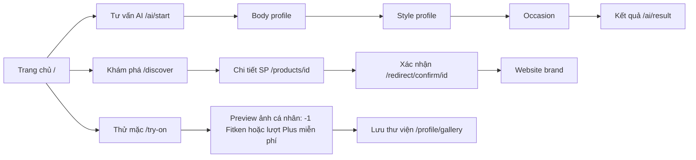

# FitMe AI — Hướng dẫn sử dụng theo vai trò

Tài liệu này dành cho **người dùng cuối, QA, demo và vận hành** — mô tả cách truy cập app (kể cả bản deploy) và sử dụng theo 3 vai trò: người dùng (FitMe Free / FitMe Premium, Fitken, Nhận thưởng, Thư viện ảnh), brand (Gói Plus, voucher, Khách quan tâm) và admin.

> **Lưu ý:** FitMe AI **không bán hàng**. FitMe tư vấn size, phối đồ và thử đồ bằng AI; khách mua tại website / cửa hàng gốc của brand qua nút **Mua tại cửa hàng gốc**. Từ bản V27, giỏ hàng, đặt hàng, sổ địa chỉ, vận đơn và đối soát seller đã bị gỡ bỏ. Preview AI mang tính minh họa tham khảo.

---

## 1. Truy cập app — đường dẫn deploy

Trong tài liệu này, **`{BASE_URL}`** = URL gốc mà admin/team cung cấp (trang chủ FitMe AI). Mọi đường dẫn khác **ghép sau** `{BASE_URL}`.

Ví dụ: nếu `{BASE_URL}` = `https://fitme-ai-mvp.vercel.app` thì trang Khám phá là  
`https://fitme-ai-mvp.vercel.app/discover`.

### 1.1 Ba môi trường thường gặp

| Môi trường | `{BASE_URL}` mẫu | Ai dùng | Ghi chú |
|------------|------------------|---------|---------|
| **Cloud (Vercel)** | `https://<tên-project>.vercel.app` | Demo public, tester bên ngoài | HTTPS; backend Render có thể **ngủ** — lần mở đầu chờ 30–60 giây |
| **Staging / VPS (Docker test)** | `http://<IP-server>:3000` | QA nội bộ, UAT trên LAN | HTTP; admin cấp IP + port |
| **Local (máy dev)** | `http://localhost:3000` | Dev, test trên máy cá nhân | Chỉ truy cập được trên máy đang chạy app |

**Người dùng thông thường chỉ cần mở `{BASE_URL}` trên trình duyệt** (Chrome, Safari, Edge). Không cần cài app, không cần mở port backend `:8080`.

Hướng dẫn deploy (dành admin): [DEPLOY_VERCEL_RENDER_NEON.md](DEPLOY_VERCEL_RENDER_NEON.md) · [DEPLOY_TEST.md](DEPLOY_TEST.md)

### 1.2 Bảng đường dẫn chính (3 vai trò)

Thay `{BASE_URL}` bằng URL thực tế của bạn.

#### Người dùng (USER) — không cần đăng nhập

| Chức năng | Đường dẫn đầy đủ |
|-----------|------------------|
| Trang chủ | `{BASE_URL}/` |
| Khám phá sản phẩm | `{BASE_URL}/discover` |
| Tìm kiếm nhanh (focus ô search) | `{BASE_URL}/discover#discover-search` |
| Chi tiết sản phẩm | `{BASE_URL}/products/{id}` |
| Bắt đầu tư vấn AI | `{BASE_URL}/ai/start` |
| Thử mặc AI (outfit board) | `{BASE_URL}/try-on` |
| Bảng giá FitMe Premium | `{BASE_URL}/pricing` |
| Outfit đã lưu | `{BASE_URL}/saved-outfits` |
| Xác nhận trước khi sang cửa hàng gốc | `{BASE_URL}/redirect/confirm/{productId}` |

#### Người dùng (USER) — cần đăng nhập

| Chức năng | Đường dẫn đầy đủ |
|-----------|------------------|
| Đăng ký | `{BASE_URL}/auth/register` (nhận ngay 5 Fitken dùng thử) |
| Đăng nhập | `{BASE_URL}/auth/login` |
| Trang Nhận thưởng (Fitken) | `{BASE_URL}/rewards` |
| Thư viện ảnh outfit cá nhân | `{BASE_URL}/profile/gallery` |
| Tủ chi tiêu (lịch sử bấm mua, đánh dấu đã mua) | `{BASE_URL}/profile/purchases` |
| Brand yêu thích (Premium) | `{BASE_URL}/profile/style-preferences` |
| Tủ đồ cá nhân (Premium) | `{BASE_URL}/wardrobe` |
| Kết quả thanh toán PayOS gói Premium | `{BASE_URL}/billing/return` |
| Hồ sơ cá nhân | `{BASE_URL}/profile` |
| Quyền riêng tư | `{BASE_URL}/profile/privacy` |
| Quên mật khẩu | `{BASE_URL}/auth/forgot-password` |
| Đặt lại mật khẩu | `{BASE_URL}/auth/reset-password?token=...` |
| Đăng ký đối tác Brand | `{BASE_URL}/brand/onboarding` |
| Theo dõi đơn đăng ký Brand | `{BASE_URL}/brand/pending` |

#### Brand Owner

| Chức năng | Đường dẫn đầy đủ |
|-----------|------------------|
| **Đăng nhập Brand Portal** | `{BASE_URL}/brand/login` |
| Tổng quan (khách thử đồ, phễu 30 ngày) | `{BASE_URL}/brand/dashboard` |
| Quản lý sản phẩm | `{BASE_URL}/brand/products` |
| Thêm sản phẩm | `{BASE_URL}/brand/products/new` |
| Khách quan tâm | `{BASE_URL}/brand/leads` |
| Nhu cầu Gen Z | `{BASE_URL}/brand/insights/demand` |
| Phân tích hành vi | `{BASE_URL}/brand/analytics` |
| Gói Plus & voucher | `{BASE_URL}/brand/plan` |
| Kết quả thanh toán Gói Plus | `{BASE_URL}/brand/plan/return` |
| Cài đặt thương hiệu | `{BASE_URL}/brand/settings` |

#### Admin

| Chức năng | Đường dẫn đầy đủ |
|-----------|------------------|
| **Đăng nhập Admin** | `{BASE_URL}/admin/login` |
| Tổng quan hệ thống | `{BASE_URL}/admin/dashboard` |
| Quản lý tài khoản | `{BASE_URL}/admin/users` |
| Thống kê truy cập | `{BASE_URL}/admin/traffic` |
| Duyệt thương hiệu | `{BASE_URL}/admin/brands` |
| Partnerships (cặp brand cho Partner look) | `{BASE_URL}/admin/partnerships` |
| Gói dịch vụ (gói người dùng + gói brand) | `{BASE_URL}/admin/billing/plans` |
| Voucher brand | `{BASE_URL}/admin/vouchers` |
| Duyệt bài chia sẻ nhận thưởng | `{BASE_URL}/admin/rewards` |
| Kiểm duyệt đánh giá sản phẩm | `{BASE_URL}/admin/reviews` |
| Duyệt sản phẩm | `{BASE_URL}/admin/products/moderation` |
| Link bị gắn cờ | `{BASE_URL}/admin/flagged-links` |
| Phân tích tăng trưởng | `{BASE_URL}/admin/analytics` |
| Khách quay lại | `{BASE_URL}/admin/retention` |
| Khách trả tiền | `{BASE_URL}/admin/paying-customers` |
| Quyền riêng tư | `{BASE_URL}/admin/privacy` |
| Giám sát thử mặc | `{BASE_URL}/admin/try-on-monitoring` |
| Avatar mẫu thử đồ | `{BASE_URL}/admin/tryon-avatars` |
| Cài đặt hệ thống | `{BASE_URL}/admin/settings` |
| Rule AI | `{BASE_URL}/admin/rules/styles` · `{BASE_URL}/admin/rules/occasions` |
| Đổi mật khẩu | `{BASE_URL}/admin/account` |

### 1.3 Ví dụ cụ thể — bản deploy cloud

Sau khi team deploy lên Vercel + Render (xem [DEPLOY_VERCEL_RENDER_NEON.md](DEPLOY_VERCEL_RENDER_NEON.md)), URL thường có dạng:

| Thành phần | URL ví dụ |
|------------|-----------|
| **App cho user (mở link này)** | `https://fitme-ai-mvp.vercel.app` |
| Đăng nhập User | `https://fitme-ai-mvp.vercel.app/auth/login` |
| Brand Portal | `https://fitme-ai-mvp.vercel.app/brand/login` |
| Admin Portal | `https://fitme-ai-mvp.vercel.app/admin/login` |
| API (qua proxy, kiểm tra kỹ thuật) | `https://fitme-ai-mvp.vercel.app/api/v1/products` |

> URL Vercel thực tế phụ thuộc tên project khi deploy — hỏi admin hoặc xem dashboard Vercel. Ví dụ trên chỉ là mẫu.

### 1.4 Ví dụ cụ thể — staging trên VPS / LAN

Admin deploy bằng `docker-compose.test.yml` và mở firewall port **3000**:

| Thành phần | URL ví dụ |
|------------|-----------|
| **App cho user** | `http://203.0.113.10:3000` |
| Brand Portal | `http://203.0.113.10:3000/brand/login` |
| Admin Portal | `http://203.0.113.10:3000/admin/login` |

Biến `PUBLIC_APP_URL` trong `.env.test` **phải khớp** URL trên (scheme + IP + port) — nếu không, đăng nhập/API có thể lỗi CORS.

### 1.5 Kiểm tra app deploy đã sẵn sàng

1. Mở `{BASE_URL}` — thấy trang chủ *「Đúng size, hợp dáng, chuẩn màu — thử trước khi mua.」*
2. Mở `{BASE_URL}/discover` — có danh sách sản phẩm (cần seed hoặc admin đã duyệt SP)
3. (Tùy chọn) Mở `{BASE_URL}/api/v1/products` — JSON `"success": true`

**Cloud Render free:** nếu trang load chậm hoặc API lỗi lần đầu, đợi ~1 phút rồi refresh (backend đang wake up).

### 1.6 Tài khoản demo (seed)

Dùng trên mọi môi trường có bật seed (`FITME_SEED_ENABLED=true`, DB trống lần đầu):

| Email | Vai trò | Đăng nhập tại |
|-------|---------|---------------|
| `user@fitme.ai` | USER (FitMe Free) | `{BASE_URL}/auth/login` |
| `premium@fitme.ai` | USER (FitMe Premium) | `{BASE_URL}/auth/login` |
| `teelab@fitme.ai`, `dirtycoins@fitme.ai`, `regods@fitme.ai`, `ulzzang@fitme.ai`, `lenclothing@fitme.ai`, `hagoo@fitme.ai`, `gumac@fitme.ai` | BRAND_OWNER — mỗi tài khoản quản lý đúng một brand (Teelab, DirtyCoins, Regods, ULZZANG, Len Clothing, HAGOO, GUMAC) | `{BASE_URL}/brand/login` |
| `brand@fitme.ai` | BRAND_OWNER chưa có brand — dùng thử luồng đăng ký brand mới | `{BASE_URL}/brand/login` |
| `admin@fitme.ai` | ADMIN | `{BASE_URL}/admin/login` |

Mật khẩu **không ghi trong tài liệu**: là giá trị biến môi trường `FITME_SEED_PASSWORD` khi seed. Script smoke trên prod đọc tài khoản từ `FITME_EMAIL` / `FITME_PASSWORD`. Hỏi admin môi trường nếu cần.

Tài khoản brand được tạo (đã xác thực email) khi backend khởi động, kể cả trên prod (`FITME_SEED_ENABLED=false`); brand nào còn thuộc `brand@fitme.ai` hoặc chưa có chủ sẽ được chuyển sang tài khoản riêng. Các tài khoản này có **mật khẩu ngẫu nhiên không ai biết**, nên chưa đăng nhập được cho tới khi admin bàn giao:

1. Admin vào **Quản trị → Tài khoản**, tìm tài khoản brand (vd. `teelab@fitme.ai`).
2. Bấm **Đăng nhập**, nhập email thật của brand và/hoặc mật khẩu mới (tối thiểu 8 ký tự), lưu.
3. Gửi thông tin cho brand qua kênh riêng; brand đăng nhập tại `{BASE_URL}/brand/login` và nên đổi mật khẩu ngay.

Khởi động lại backend không bao giờ đổi lại mật khẩu hay email đã bàn giao. Brand đổi hồ sơ, logo hoặc sửa sản phẩm thì dữ liệu catalog gốc không ghi đè lên nữa. Ảnh sản phẩm và logo của catalog được sao chép về kho media FitMe (Cloudflare R2 trên prod) ngay sau khi khởi động, không dẫn link trực tiếp tới CDN Shopee.

### 1.7 Sử dụng trên điện thoại (mobile)

Trên màn hình **nhỏ hơn tablet** (< 768px), app người dùng có giao diện kiểu app mobile:

**Thanh điều hướng dưới (bottom nav)** — 5 tab cố định:

| Tab | Chức năng |
|-----|-----------|
| Trang chủ | Về `{BASE_URL}/` |
| Khám phá | `{BASE_URL}/discover` |
| **Tư vấn AI** (nút giữa nổi) | `{BASE_URL}/ai/start` |
| Thử mặc | `{BASE_URL}/try-on` |
| Hồ sơ | `{BASE_URL}/profile` (chưa login → trang đăng nhập) |

**Header gọn:** logo FitMe AI + icon tìm kiếm nhanh (không còn menu hamburger, không có giỏ hàng).

**Tủ đồ / Outfit đã lưu / Quyền riêng tư:** vào tab **Hồ sơ** → chọn card tương ứng.

**Khám phá trên mobile:** ô tìm kiếm full-width + nút **Bộ lọc** (thương hiệu, danh mục, chỉ SP thử AI).

**Khi bottom nav ẩn:** đang đăng nhập/đăng ký, wizard tư vấn AI (body/style/occasion…), form thử mặc chi tiết, trang redirect — để tập trung hoàn thành luồng.

**Brand / Admin portal:** vẫn dùng giao diện desktop; khuyến nghị mở trên máy tính hoặc tablet ngang.

---

## 2. Chuẩn bị local (dev / QA trên máy)

Phần này dành cho người **tự chạy app trên máy**, không phải bản deploy public.

### Chạy nhanh (Docker)

```bash
cp .env.example .env
docker compose up --build
```

`{BASE_URL}` = `http://localhost:3000`

| Dịch vụ | URL |
|---------|-----|
| Frontend | http://localhost:3000 |
| API (qua proxy FE) | http://localhost:3000/api/v1 |
| Backend trực tiếp | http://localhost:8080/api/v1 |
| Swagger | http://localhost:8080/swagger-ui.html |

### Chạy local (dev)

```bash
# Terminal 1 — Postgres
docker compose up postgres -d

# Terminal 2 — Backend
cd backend && mvn spring-boot:run

# Terminal 3 — Frontend
cd frontend && npm install && npm run dev
```

---

## 3. Vai trò USER (Người dùng)

### 3.1 Mục đích

Khám phá thời trang Gen Z, nhận tư vấn size & phối đồ bằng AI, thử đồ ảo bằng Fitken (hoặc miễn phí với brand Plus), tích lũy Fitken tại trang Nhận thưởng, lưu outfit trong thư viện ảnh, rồi mua tại cửa hàng gốc của brand. Nâng cấp **FitMe Premium** để dùng tủ đồ cá nhân, phối đồ theo brand yêu thích và nhận Fitken hằng tháng.

### 3.2 Fitken, trần Fitken miễn phí & FitMe Premium

- **Fitken**: đơn vị tính lượt dùng AI — `1 Fitken = 1 lượt thử đồ AI` (chế độ ảnh người thật `USER_PHOTO` hoặc `AVATAR`). Tạo bảng phối minh họa (`OUTFIT_BOARD_ONLY`) và chat stylist AI miễn phí.
- **Tặng dùng thử**: tài khoản mới nhận **5 Fitken** một lần duy nhất.
- **Ví 2 ngăn**:
  - `subscription_remaining`: Fitken từ gói Premium, reset về 0 khi gói hết hạn.
  - `bonus_remaining`: Fitken từ quà dùng thử, nhận thưởng, top-up, admin tặng — không hết hạn.
  - Luôn tiêu ngăn subscription trước, rồi mới trừ bonus.
  - Trừ Fitken khi bấm tạo ảnh, tự hoàn (+1) nếu tạo ảnh thất bại.
- **Trần Fitken miễn phí** (mặc định **50**, admin chỉnh tại *Cài đặt hệ thống*): quà dùng thử, điểm danh, chia sẻ và đánh giá chỉ cộng tới khi ví chạm trần; vượt trần thì phần thưởng là 0. Fitken từ gói Premium, top-up và admin điều chỉnh **không** bị áp trần. Ví hiển thị mức trần hiện tại.
- **FitMe Premium** (giá mặc định 49.000đ / 30 ngày, admin có thể đổi):
  - Mua tại `/pricing`, thanh toán PayOS; kết quả hiện ở `/billing/return`.
  - **15 Fitken mỗi tháng** để thử đồ AI.
  - **Tủ đồ cá nhân** (`/wardrobe`) và phối kèm đồ có sẵn. Tài khoản Free mở tủ đồ thấy lời mời nâng cấp.
  - **Brand yêu thích** (`/profile/style-preferences`): chọn tối đa 10 brand và chế độ *Đa dạng* hoặc *Chỉ brand yêu thích* để stylist AI phối theo. Free xem được nhưng không lưu được.
  - Hết 30 ngày: tự về Free, ngăn subscription reset về 0.
- **FitMe Free**: 5 Fitken dùng thử, phối đồ từ sản phẩm của các brand, lưu outfit yêu thích, nhận thêm Fitken qua nhiệm vụ.

### 3.3 Thử đồ miễn phí với brand Plus

- Sản phẩm của brand đang dùng **Gói Plus** có huy hiệu Plus.
- Khi mọi sản phẩm trong lượt thử đều thuộc brand Plus, người dùng **đã đăng nhập** được thử **miễn phí** tối đa **3 lượt mỗi ngày** (admin chỉnh tại *Cài đặt hệ thống*). Màn hình thử đồ báo trước lượt thử là miễn phí hay tốn Fitken.
- Hết lượt miễn phí, hoặc có sản phẩm không thuộc brand Plus: tính Fitken như bình thường. Khách chưa đăng nhập không có lượt miễn phí.
- Tạo ảnh lỗi thì lượt miễn phí được hoàn lại.

### 3.4 Trang Nhận thưởng (`/rewards`)

Kiếm thêm Fitken miễn phí mỗi ngày (theo múi giờ `Asia/Ho_Chi_Minh`), trong giới hạn trần Fitken miễn phí:

1. **Điểm danh**: mỗi ngày 1 lần. Chuỗi 3 ngày liên tiếp (`streak % 3 == 0`) nhận **+1 Fitken**. Bỏ lỡ 1 ngày thì chuỗi bắt đầu lại từ 1.
2. **Chia sẻ bài đăng**: đăng ảnh thử đồ lên mạng xã hội (Facebook, TikTok, Instagram, Threads, X/Twitter) ở chế độ công khai rồi dán link tại `/rewards` — **+3 Fitken** (tối đa 1 lần/ngày).
3. **Đánh giá sản phẩm có ảnh**: review tại `/products/{id}` có ≥ 1 ảnh và nội dung ≥ 20 ký tự — **+2 Fitken** (tối đa 1 đánh giá được thưởng/ngày).

### 3.5 Thư viện ảnh phối đồ (`/profile/gallery`)

- Ảnh thử đồ AI tạo thành công khi đã đăng nhập được tự lưu vào thư viện.
- Khách vãng lai sau khi đăng nhập được tự liên kết các ảnh đã thử trong phiên.
- Tại `/profile/gallery`, người dùng có thể:
  - Xem lưới ảnh và phóng to chi tiết.
  - Tải ảnh về máy hoặc chia sẻ lên mạng xã hội để nhận thưởng.
  - Xem danh sách sản phẩm trong outfit và mở trang sản phẩm để mua tại cửa hàng gốc.
  - Xóa mềm ảnh khỏi thư viện.

### 3.6 Mua tại cửa hàng gốc & chia sẻ thông tin với brand

FitMe không có giỏ hàng hay thanh toán đơn hàng. Trang chi tiết sản phẩm chỉ có 3 nút: **Mua tại cửa hàng gốc**, **Tư vấn size & phối đồ bằng AI** và **Thử mặc bằng AI**. Màu và size hiển thị dạng nhãn để tham khảo.

1. Bấm **Mua tại cửa hàng gốc** → trang xác nhận `/redirect/confirm/{productId}`.
2. Người dùng đã đăng nhập thấy ô **"Chia sẻ tên và email với brand khi bạn bấm mua, để brand liên hệ tư vấn và xác nhận đơn"**. Ô này mặc định theo lựa chọn gần nhất, bật/tắt bất kỳ lúc nào (cũng chỉnh được tại `/profile/privacy`).
3. Bấm tiếp tục → `/redirect/loading` → mở website / sàn của brand (đúng link mua brand đã khai báo).
4. Nếu đang đồng ý chia sẻ, brand nhận **1 khách quan tâm** cho sản phẩm đó trong ngày (tên, email, size/màu đã chọn). Khách vãng lai hoặc không đồng ý: brand không nhận thông tin cá nhân.
5. Rút lại đồng ý: các lượt cũ ở phía brand hiện "khách đã rút đồng ý", không còn tên/email. Xóa toàn bộ tài khoản: lượt cũ được ẩn danh hoá.
6. **Tủ chi tiêu** (`/profile/purchases`): xem lịch sử bấm mua và bấm **đánh dấu đã mua** khi đã mua thật. Đánh giá của người đã đánh dấu đã mua (hoặc được brand Plus xác nhận đã bán) có nhãn **Đã mua hàng**.

### 3.7 Luồng tư vấn AI, thử đồ & mua


```mermaid
flowchart LR
  A[Trang chủ /] --> B[Tư vấn AI /ai/start]
  B --> C[Body profile]
  C --> D[Style profile]
  D --> E[Occasion]
  E --> F[Kết quả /ai/result]
  A --> G[Khám phá /discover]
  G --> H[Chi tiết SP /products/id]
  H --> I[Xác nhận /redirect/confirm/id]
  I --> J[Website brand]
  A --> K[Thử mặc /try-on]
  K --> L[Preview ảnh cá nhân: -1 Fitken hoặc lượt Plus miễn phí]
  L --> M[Lưu thư viện /profile/gallery]
```

### 3.8 Bảng tính năng cần đăng nhập

| Hành động | Đường dẫn | Quyền lợi & Ghi chú |
|-----------|-----------|---------------------|
| Đăng ký | `/auth/register` | Nhận ngay **5 Fitken** dùng thử |
| Đăng nhập | `/auth/login` | Đồng bộ dữ liệu tư vấn & ảnh thử đồ từ phiên ẩn danh |
| Nâng cấp Premium | `/pricing` | FitMe Premium qua PayOS |
| Nhận thưởng | `/rewards` | Điểm danh, nộp link chia sẻ, tích lũy Fitken (có trần) |
| Thư viện ảnh | `/profile/gallery` | Bộ sưu tập ảnh outfit cá nhân |
| Tủ chi tiêu | `/profile/purchases` | Lịch sử bấm mua, đánh dấu đã mua |
| Brand yêu thích | `/profile/style-preferences` | Premium: lưu brand yêu thích & chế độ phối |
| Tủ đồ | `/wardrobe` | Premium: thêm item cá nhân vào tủ ảo |
| Hồ sơ | `/profile` | Body/style profile |
| Quyền riêng tư | `/profile/privacy` | Consent (kể cả chia sẻ thông tin với brand), yêu cầu xóa dữ liệu |
| Outfit đã lưu | `/saved-outfits` | Quản lý gợi ý phối đồ đã lưu |

### 3.9 Đăng ký làm đối tác Brand (từ USER)

1. Đăng ký USER tại `/auth/register`
2. Vào `/brand/onboarding` — điền tên brand, email, website, mô tả
3. Theo dõi trạng thái tại `/brand/pending` (PENDING)
4. Admin duyệt → **đăng xuất và đăng nhập lại** tại `/brand/login`
5. Vào portal brand `/brand/dashboard`

### 3.10 Checklist test USER

| # | Kịch bản | Cách chạy tự động |
|---|----------|-------------------|
| 1 | Tư vấn ẩn danh → có kết quả AI | `npx playwright test e2e/role-flows.spec.ts -g "tư vấn outfit ẩn danh"` |
| 2 | Try-on → preview kết quả | `-g "thử mặc AI"` |
| 3 | Khám phá → chi tiết SP → chuyển hướng mua | `-g "khám phá"` |
| 4 | Login → profile → wardrobe → saved | `-g "đăng nhập → hồ sơ"` |
| 5 | Forgot password MVP | `-g "quên mật khẩu"` |
| 6 | Privacy → gửi yêu cầu xóa | `-g "quyền riêng tư"` |
| 7 | Tư vấn từ SP → lưu → saved list | `-g "tư vấn từ sản phẩm"` |
| 8 | Tủ đồ (Premium) → tư vấn ưu tiên tủ đồ | `-g "tủ đồ → thêm item"` |
| 9 | Xác nhận mua, bật/tắt chia sẻ thông tin, không open redirect | `npx playwright test e2e/redirect-flow.spec.ts` |

**Chạy toàn bộ luồng USER + public:**

```powershell
cd frontend
npx playwright test e2e/role-flows.spec.ts --grep "Luồng công khai|Luồng USER" --workers=1
```

**Test thủ công nhanh:** đăng nhập `user@fitme.ai` (mật khẩu seed, xem mục 1.6) → `/discover` → chọn sản phẩm → **Tư vấn size & phối đồ bằng AI** → hoàn thành wizard → **Lưu gợi ý** → kiểm tra `/saved-outfits` → quay lại sản phẩm → **Mua tại cửa hàng gốc** → kiểm tra trang xác nhận và ô chia sẻ thông tin.

---

## 4. Vai trò BRAND_OWNER (Đối tác thương hiệu)

### 4.1 Mục đích

Quản lý catalog sản phẩm (kèm link mua tại cửa hàng gốc), theo dõi khách thử đồ và bấm mua, nhận thông tin khách quan tâm, và mua **Gói Plus** để tăng hiển thị và chăm sóc khách.

> **Chính sách:** Dashboard brand **miễn phí** cho mọi thương hiệu đã được duyệt (`APPROVED`). **Gói Plus** là tuỳ chọn trả phí theo kỳ 30 ngày (giá mặc định 999.000đ, admin có thể đổi và đặt giảm giá).

### 4.2 Truy cập portal

1. Mở **`{BASE_URL}/brand/login`**
2. Đăng nhập tài khoản brand đã được admin duyệt
3. Middleware FE chặn `/brand/*` nếu cookie `fitme-role` ≠ `BRAND`

### 4.3 Các màn hình portal

Menu: **Tổng quan · Sản phẩm · Khách quan tâm · Nhu cầu Gen Z · Phân tích · Gói Plus · Cài đặt**.

| Đường dẫn | Chức năng |
|-----------|-----------|
| `/brand/dashboard` | Số khách thử đồ 7 / 30 ngày, top sản phẩm được thử, phễu 30 ngày (thử đồ → bấm mua → đã bán). Không chứa thông tin cá nhân, không cần Plus |
| `/brand/products` | Danh sách sản phẩm của shop |
| `/brand/products/new` | Tạo sản phẩm mới — **Link mua hàng bắt buộc** (URL hợp lệ, tối đa 2048 ký tự) |
| `/brand/products/{id}/edit` | Sửa, **Gửi duyệt** |
| `/brand/products/{id}/analytics` | Analytics chi tiết theo từng sản phẩm |
| `/brand/leads` | **Khách quan tâm** (xem mục 4.6) |
| `/brand/insights/demand` | Nhu cầu Gen Z: like, click mua, xác nhận mua (ẩn danh) |
| `/brand/analytics` | Phân tích tổng thể phễu khách hàng |
| `/brand/analytics/redirect` | Click chuyển hướng mua theo kênh |
| `/brand/analytics/dropoff` | Điểm rời bỏ funnel |
| `/brand/analytics/hesitation` | Hành vi do dự của khách |
| `/brand/analytics/try-on` | Thống kê lượt thử đồ AI |
| `/brand/plan` | **Gói Plus**: trạng thái, giá, voucher, mua / gia hạn |
| `/brand/settings` | Cài đặt thông tin thương hiệu |

### 4.4 Gói Plus (`/brand/plan`)

**Quyền lợi khi Plus đang hiệu lực:**

- Huy hiệu Plus trên sản phẩm của brand.
- Khách đã đăng nhập được **thử đồ miễn phí** sản phẩm của brand (mặc định 3 lượt/ngày/khách).
- Sản phẩm được **ưu tiên trong gợi ý** của stylist AI (điểm ưu tiên do admin cài đặt).
- Xem **đầy đủ danh sách Khách quan tâm** (tên, email, size/màu) và đánh dấu **Đã bán**.

**Mua / gia hạn:**

1. Vào `/brand/plan` — xem giá gốc, giá sau giảm (nếu chương trình giảm giá đang chạy) và thời hạn hiện tại.
2. (Tuỳ chọn) chọn một **voucher** đang dùng được. Hệ thống chỉ áp dụng **một** mức giảm: mức cao hơn giữa chương trình giảm giá của gói và voucher. Nếu chương trình bằng hoặc cao hơn voucher, voucher được **giữ lại** cho lần sau và màn hình giải thích lý do.
3. Bấm thanh toán → PayOS → quay về `/brand/plan/return`.
4. Thanh toán thành công: Plus có hiệu lực 30 ngày; gia hạn khi đang Plus thì **cộng nối** vào ngày hết hạn hiện tại.
5. Đơn chờ thanh toán có thể **huỷ**; voucher đang giữ cho đơn được trả lại. Đơn chờ quá 24 giờ tự hết hạn.

Hết hạn: Plus tự tắt (job hằng ngày), danh sách khách quan tâm bị khoá chi tiết, huy hiệu và lượt thử miễn phí ngừng áp dụng.

### 4.5 Voucher brand

- Admin phát voucher theo **chiến dịch** (giảm X% Gói Plus). Voucher hiện ở `/brand/plan` cùng trạng thái:

| Trạng thái | Ý nghĩa |
|------------|---------|
| Còn dùng được (`ISSUED`) | Chọn được khi thanh toán |
| Đang giữ (`RESERVED`) | Đang gắn với một đơn chưa hoàn tất; huỷ đơn hoặc chờ đơn hết hạn để dùng lại |
| Đã dùng (`USED`) | Đã áp dụng cho đơn thanh toán thành công |
| Đã thu hồi (`REVOKED`) | Admin thu hồi |
| Hết hạn (`EXPIRED`) | Quá hạn chiến dịch |

- Mỗi voucher chỉ dùng một lần, chỉ cho chính brand được phát.

### 4.6 Khách quan tâm (`/brand/leads`)

- Mỗi khi khách đã đăng nhập **đồng ý chia sẻ thông tin** và bấm **Mua tại cửa hàng gốc** trên sản phẩm của brand, brand nhận 1 khách quan tâm (tối đa 1 lượt / khách / sản phẩm / ngày).
- **Không Plus:** chỉ thấy số tổng (tổng khách, đã bán, 30 ngày gần nhất) kèm lời mời nâng cấp.
- **Có Plus:** thấy danh sách tên, email, sản phẩm, size, màu, thời điểm; lọc theo khoảng ngày, sản phẩm, trạng thái đã bán; đánh dấu / bỏ đánh dấu **Đã bán** (đánh giá của khách đó có nhãn *Đã mua hàng*).
- Khách rút đồng ý → dòng hiện "khách đã rút đồng ý", không còn tên/email. Khách xoá tài khoản → dòng được ẩn danh.
- Chỉ dùng thông tin để tư vấn / xác nhận đơn cho chính khách đó; không chia sẻ cho bên thứ ba.

---

## 5. Vai trò ADMIN

### 5.1 Mục đích

Vận hành và quản trị nền tảng: quản lý tài khoản (kể cả gán Premium), duyệt thương hiệu / sản phẩm, cấu hình gói dịch vụ cho người dùng và brand, phát voucher brand, chỉnh cài đặt hệ thống, duyệt chia sẻ nhận thưởng, kiểm duyệt đánh giá, theo dõi tăng trưởng / khách quay lại / khách trả tiền, cấu hình rules AI và giám sát kỹ thuật.

### 5.2 Truy cập portal

1. Mở **`{BASE_URL}/admin/login`**
2. Đăng nhập `admin@fitme.ai` (hoặc tài khoản ADMIN khác)
3. Middleware FE chặn `/admin/*` nếu cookie ≠ `ADMIN`

### 5.3 Các màn hình portal

| Đường dẫn | Chức năng |
|-----------|-----------|
| `/admin/dashboard` | Tổng quan hệ thống |
| `/admin/users` | Quản lý tài khoản: khoá / mở, **Lên Premium / Về Free**, xem & điều chỉnh ví Fitken |
| `/admin/traffic` | Thống kê truy cập |
| `/admin/brands` | Duyệt / quản lý brand (PENDING → APPROVED), xem brand nào đang Plus và ngày hết hạn |
| `/admin/partnerships` | Cặp brand cho Partner look |
| `/admin/billing/plans` | **Gói dịch vụ** (2 tab, xem mục 5.5) |
| `/admin/vouchers` | **Voucher brand**: chiến dịch, phát, thu hồi (mục 5.6) |
| `/admin/rewards` | Duyệt link chia sẻ nhận thưởng Fitken |
| `/admin/reviews` | Kiểm duyệt đánh giá sản phẩm |
| `/admin/products/moderation` | Duyệt sản phẩm PENDING_REVIEW (không duyệt được nếu thiếu link mua hợp lệ) |
| `/admin/flagged-links` | Link mua bị gắn cờ |
| `/admin/analytics` | Phân tích tăng trưởng |
| `/admin/retention` | **Khách quay lại** (mục 5.8) |
| `/admin/paying-customers` | Khách trả tiền (giao dịch gói Premium; tách giao dịch PayOS mock), xuất file |
| `/admin/privacy` | Consent & yêu cầu xóa dữ liệu |
| `/admin/try-on-monitoring` | Giám sát try-on / preview thất bại |
| `/admin/tryon-avatars` | Avatar mẫu thử đồ |
| `/admin/settings` | **Cài đặt hệ thống** (mục 5.7) |
| `/admin/rules/styles` · `/admin/rules/occasions` | Rule phong cách / hoàn cảnh |
| `/admin/account` | Đổi mật khẩu |

### 5.4 Quy trình duyệt brand mới

1. USER gửi đơn tại `/brand/onboarding`
2. Admin vào `/admin/brands` → tìm brand **PENDING** → **Duyệt**
3. Hệ thống nâng role user thành `BRAND_OWNER`
4. User **phải đăng xuất và đăng nhập lại** mới vào được `/brand/dashboard`

### 5.5 Gói dịch vụ (`/admin/billing/plans`)

Hai tab:

- **Gói người dùng**: FitMe Premium (gói tháng, có số Fitken mỗi kỳ) và các gói top-up Fitken. Gói người dùng không có giảm giá theo thời gian.
- **Gói brand**: Brand Plus (gói theo chu kỳ). Đặt **% giảm giá** kèm thời điểm bắt đầu / kết thúc; trong khoảng đó brand thấy giá sau giảm. Tab này cũng có danh sách brand đã mua Plus.

Quy tắc: không đổi được mã gói hoặc đối tượng (người dùng / brand) sau khi tạo; gói đã có người mua thì tắt (`active=false`) thay vì xóa.

### 5.6 Voucher brand (`/admin/vouchers`)

1. Tạo **chiến dịch**: tên, % giảm (1–99), số voucher mỗi brand (1–100), số brand tối đa, thời gian hiệu lực, bật/tắt.
2. Mở chiến dịch → chọn brand đã duyệt → **Phát voucher**. Brand đã nhận ở chiến dịch này được bỏ qua; vượt số brand tối đa thì bị chặn kèm số suất còn lại.
3. Xem danh sách voucher đã phát theo trạng thái; **Thu hồi** voucher còn dùng được. Không thu hồi được voucher đang giữ cho đơn, đã dùng hoặc đã hết hạn.
4. Đổi % của chiến dịch không ảnh hưởng voucher đã phát.

### 5.7 Cài đặt hệ thống (`/admin/settings`)

| Cài đặt | Mặc định | Ý nghĩa |
|---------|----------|---------|
| Trần Fitken miễn phí | 50 | Mức tối đa Fitken từ quà dùng thử / nhận thưởng trong ví |
| Lượt thử đồ miễn phí mỗi ngày (brand Plus) | 3 | Số lượt thử miễn phí / khách / ngày cho sản phẩm brand Plus (0 = tắt) |
| Điểm ưu tiên gợi ý (brand Plus) | 15 | Mức ưu tiên sản phẩm brand Plus trong gợi ý AI (0 = tắt) |

Giá trị phải là số nguyên trong khoảng cho phép; thay đổi có hiệu lực trong khoảng 1 phút.

### 5.8 Khách quay lại (`/admin/retention`)

- **Nhóm đăng ký theo tuần**: tỉ lệ người dùng còn hoạt động ở các tuần sau khi đăng ký.
- **Tần suất hoạt động**: số ngày có hoạt động trong 30 ngày qua.
- **Khách đã rời đi**: từng hoạt động nhưng không quay lại trong 30 ngày.
- **Khách hoạt động nhiều nhất**: top 20 theo số ngày hoạt động, kèm số lượt tư vấn, thử đồ, bấm mua.

### 5.9 Checklist test ADMIN

| # | Kịch bản | Lệnh Playwright |
|---|----------|-----------------|
| 1 | Smoke tất cả trang admin | `npx playwright test e2e/role-flows.spec.ts -g "Luồng ADMIN"` |
| 2 | Duyệt SP pending | `-g "duyệt sản phẩm pending"` |
| 3 | Duyệt brand + luồng liên role | `-g "Brand application"` |
| 4 | Admin flows đầy đủ | `npx playwright test e2e/admin-full.spec.ts` |

**Test thủ công:** login admin → `/admin/products/moderation` → **Duyệt** sản phẩm pending → kiểm tra SP hiện trên `/discover`. Gói Plus, voucher và cài đặt hệ thống hiện chưa có E2E — xem [test-cases/06-brand-plus-voucher-lead.md](test-cases/06-brand-plus-voucher-lead.md) và [test-cases/11-admin-portal.md](test-cases/11-admin-portal.md).

---

## 6. Luồng liên role (end-to-end)

Kịch bản đặc biệt — mô phỏng onboarding brand thực tế:

```
USER đăng ký mới
  → /brand/onboarding (gửi đơn)
  → /brand/pending
ADMIN duyệt brand
  → USER đăng nhập /brand/login
  → /brand/dashboard
```

**Chạy tự động:**

```powershell
cd frontend
npx playwright test e2e/role-flows.spec.ts -g "Brand application" --workers=1
```

Kịch bản Brand Plus (thủ công): admin phát voucher cho brand → brand mua Gói Plus có voucher → user đồng ý chia sẻ thông tin và bấm mua sản phẩm của brand → brand thấy khách quan tâm và đánh dấu Đã bán → đánh giá của user có nhãn *Đã mua hàng*.

---

## 7. Chạy test toàn hệ thống

### 7.1 Theo lớp

```powershell
# Tất cả (BE unit + FE unit + E2E từng spec)
.\scripts\test-flows.ps1

# Chỉ E2E (cần FE :3000 + BE :8080)
.\scripts\test-flows.ps1 -E2eOnly

# Chỉ unit
.\scripts\test-flows.ps1 -SkipE2e
```

```bash
# Linux/macOS E2E CI-style
bash scripts/ci-e2e.sh
```

### 7.2 Bảng map spec E2E ↔ luồng (22 spec)

| Spec file | Phạm vi |
|-----------|---------|
| `smoke-routes.spec.ts` | Mọi route public load đúng heading |
| `navigation.spec.ts` | Header, footer, logo, quick search |
| `mobile-nav.spec.ts` | Bottom nav mobile (iPhone 13 viewport) |
| `auth-pages.spec.ts` | Trang auth render |
| `auth-flow.spec.ts` | Login, logout, forgot password |
| `rbac.spec.ts` | Guard brand/admin |
| `discover.spec.ts` | Discover + filter |
| `consultation-anonymous.spec.ts` | AI wizard ẩn danh |
| `product-advice.spec.ts` | Tư vấn từ sản phẩm |
| `photo-preview.spec.ts` | Upload ảnh preview |
| `ai-extras.spec.ts` | Trang AI phụ |
| `try-on.spec.ts` | Try-on chính |
| `try-on-extras.spec.ts` | Try-on phụ (size/form/color…) |
| `wardrobe.spec.ts` | Premium thêm item tủ đồ; Free thấy lời mời nâng cấp |
| `saved-outfits.spec.ts` | Danh sách đã lưu |
| `redirect-flow.spec.ts` | Mua tại cửa hàng gốc: chống open redirect, xác nhận → loading, ô chia sẻ thông tin |
| `brand-portal.spec.ts` | Brand smoke |
| `brand-full.spec.ts` | Brand CRUD, dashboard mở không cần gói, link mua bắt buộc |
| `admin-portal.spec.ts` | Admin smoke |
| `admin-full.spec.ts` | Admin duyệt/flag |
| `role-flows.spec.ts` | **3 role serial** — file quan trọng nhất |
| `reset-password.spec.ts` | Reset password (cần env test) |

### 7.3 Kết quả regression gần nhất

Ở commit `bc323e2` (CI xanh):

| Lớp | Kết quả |
|-----|---------|
| Backend `mvn test` | 389 phương thức test / 94 class, pass hết (3 test `@Disabled` là lỗ hổng đã biết) |
| Frontend Vitest | 273 test / 64 file, pass hết |
| E2E Playwright | 22 spec: 127 test chromium + 5 test mobile-chrome, pass hết |

Số test BE / FE đếm trong code. Chi tiết theo module: [TEST_CASES.md](TEST_CASES.md).

### 7.4 CI GitHub Actions

Mỗi push/PR chạy: backend test → frontend unit → frontend build → **E2E (full suite)** (mọi spec trên chromium, `mobile-nav` trên mobile-chrome).

Badge: https://github.com/KhangNT04/fitme_ai_mvp/actions

---

## 8. FAQ vận hành

**Q: Tôi được cấp link deploy — vào đâu để đăng nhập Brand/Admin?**  
A: User → `{BASE_URL}/auth/login` · Brand → `{BASE_URL}/brand/login` · Admin → `{BASE_URL}/admin/login`. Xem bảng mục [1.2](#12-bảng-đường-dẫn-chính-3-vai-trò).

**Q: Link Vercel mở chậm hoặc báo lỗi API lần đầu?**  
A: Backend Render free tier **ngủ** sau ~15 phút không dùng. Đợi 30–60 giây, refresh trang. Lần sau sẽ nhanh hơn.

**Q: Staging VPS — đồng nghiệp không vào được `{BASE_URL}`?**  
A: Kiểm tra firewall đã mở port **3000**; dùng đúng IP trong `PUBLIC_APP_URL`; cùng mạng LAN nếu IP nội bộ.

**Q: Đăng nhập brand nhưng bị đá về `/brand/login`?**  
A: Kiểm tra admin đã duyệt brand chưa; sau khi duyệt phải **logout + login lại** để refresh JWT và cookie `fitme-role`.

**Q: Discover không có sản phẩm?**  
A: Cần sản phẩm trạng thái `ACTIVE` (admin duyệt). Seed tạo sẵn nếu DB trống.

**Q: Giỏ hàng / đơn hàng đâu rồi?**  
A: Đã gỡ từ V27. FitMe chỉ chuyển khách sang cửa hàng gốc của brand; đơn hàng do brand xử lý.

**Q: Brand không thấy tên / email khách quan tâm?**  
A: Cần Gói Plus đang hiệu lực, và khách phải đang đồng ý chia sẻ thông tin. Khách đã rút đồng ý hoặc xoá tài khoản sẽ không hiện thông tin cá nhân.

**Q: Voucher báo "đang được giữ"?**  
A: Voucher đang gắn với một đơn Gói Plus chưa thanh toán. Huỷ đơn đó tại `/brand/plan` hoặc chờ đơn hết hạn (24 giờ).

**Q: Người dùng không nhận thêm Fitken khi điểm danh / chia sẻ?**  
A: Ví đã chạm trần Fitken miễn phí. Admin xem / chỉnh tại `/admin/settings`.

**Q: API lỗi CORS trên bản deploy?**  
A: Admin phải cấu hình `CORS_ORIGINS` trên backend **khớp chính xác** `{BASE_URL}` (https/http, domain, port). User thường không cần sửa — gọi API qua `{BASE_URL}/api/v1` (proxy cùng domain).

**Q: API lỗi CORS trên local?**  
A: Backend `CORS_ORIGINS` phải gồm `http://localhost:3000`.

**Q: Quên mật khẩu không nhận email?**  
A: MVP dùng mock — token hiện trên màn hình forgot-password hoặc log backend `[MOCK] Password reset token`.

**Q: Middleware chặn portal nhưng API vẫn gọi được?**  
A: FE middleware chỉ guard route; BE vẫn validate JWT role (`BRAND_OWNER` / `ADMIN`) trên `/api/v1/brand/**` và `/api/v1/admin/**`.

---

## 9. Tài liệu liên quan

- [DEPLOY_VERCEL_RENDER_NEON.md](DEPLOY_VERCEL_RENDER_NEON.md) — deploy cloud (link public)
- [DEPLOY_TEST.md](DEPLOY_TEST.md) — deploy staging VPS/Docker
- [DEVELOPER_GUIDE.md](DEVELOPER_GUIDE.md) — chi tiết kỹ thuật cho dev
- [ARCHITECTURE.md](ARCHITECTURE.md) — sơ đồ kiến trúc
- [API_CONTRACT.md](API_CONTRACT.md) — mapping FE ↔ BE
- [TEST_CASES.md](TEST_CASES.md) — bộ test case theo module
- [QA_REPORT.md](QA_REPORT.md) — báo cáo QA chi tiết
